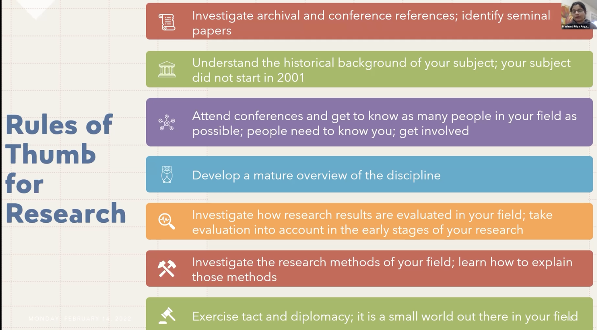
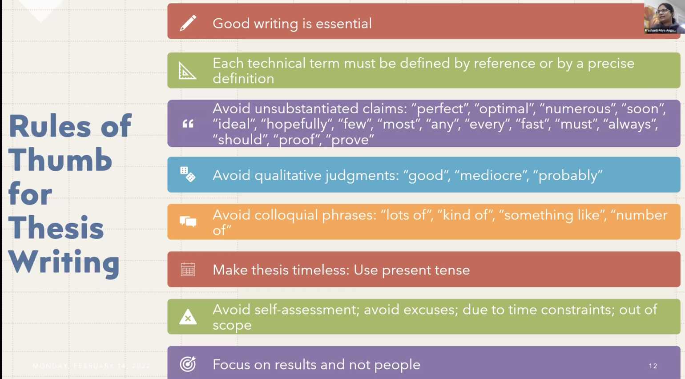
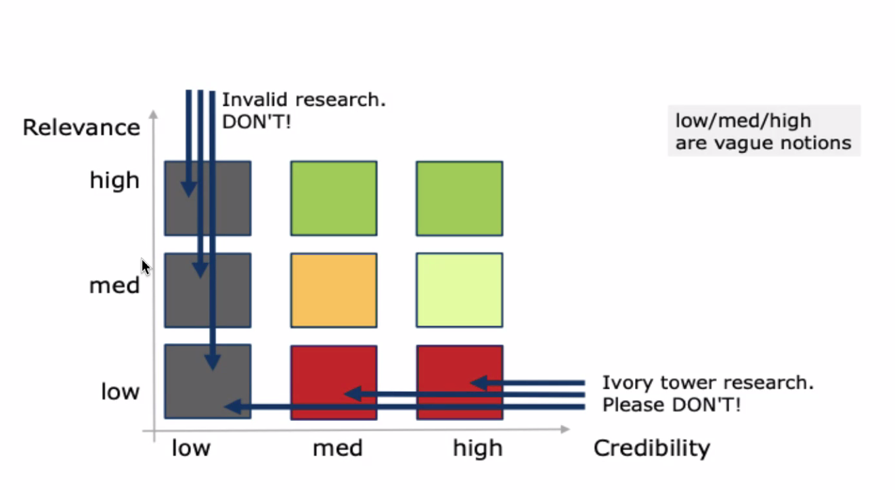
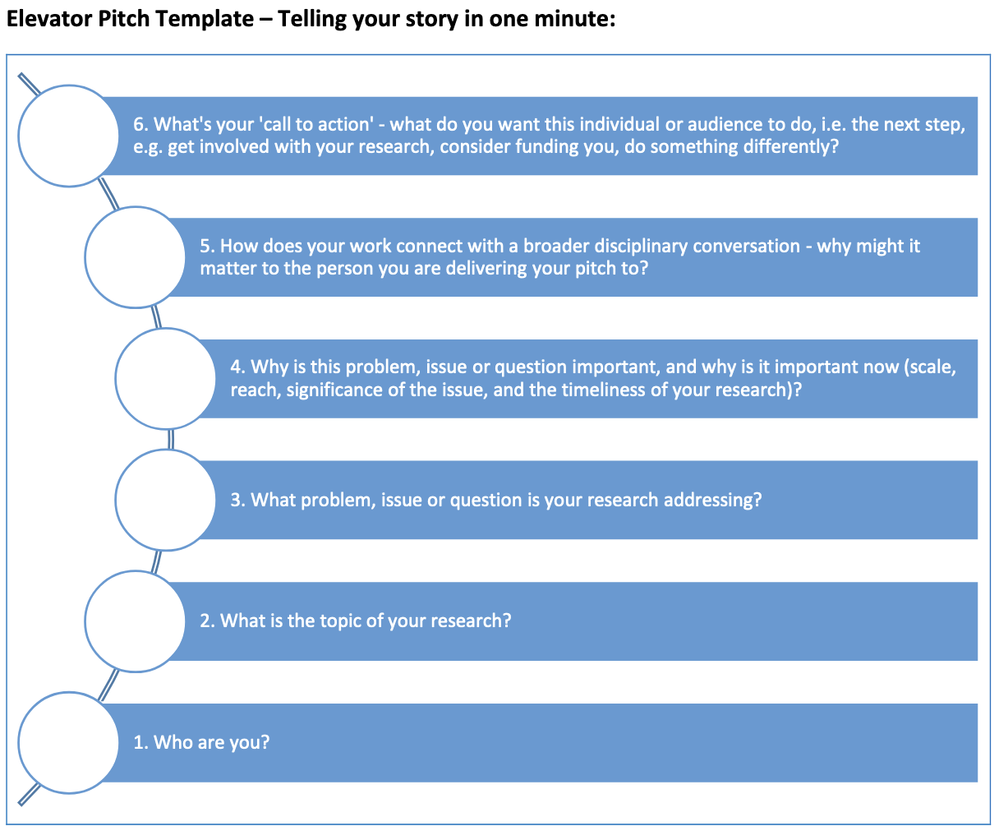

__CSC595 | Term Portfolio Project__ | Ashley Blacquiere V00134139

***

# Overview

This document is a record of my learning journey in *CSC 595 Research Methods* with Dr. Hausi Muller.

If you'd like to view this document live, check out my [GitHub Page](https://ashandoak.github.io).

# Table of contents

1. [Lecture notes, activities & post-class reflections](#lecturenotes)
2. [Research elevator pitch & discussion](#elevator-pitch)
3. [Notes & reflections on assigned homework](#homework-reflections)
4. [Research talk best practices & discussion](#research-talk)
5. [Proposed talk: How to ask good questions](#proposed-talk)
6. [Paper review: Constructive Mathematics and Computer Programming](#paper-review)
7. [Thesis introduction](#thesis-intro)
8. [Literature review & Bruce's suggestions](#lit-review)
9. [A consolidated discussion of CSC595 guest lectures](#guest-lectures)
10. [Learning outcomes](#learning-outcomes)
11. [References](#references)
12. [Useful resources](#resources)

***

# Lecture notes, activities & post-class reflections

## Lecture 1 (Jan. 10, 2022)

__Class notes:__ I liked that Dr. Muller has asked everyone to speak in the class - I think this is an important hurdle to get over and helps to encourage more consistent contributions in future classes. I elected not to speak in the first class, primarily because I'm not really sure what my story is at this point. The parameters around my research project has only really started to become well-formulated in the last month or so, but the specifics of what my role is lack a clear motivation - other that that I need to complete some particular tasks in order to support those over-arching parameters. 

There were plenty of people who stated that their projects were not fully identified yet, and I don't really mind saying this, but I would rather give it a bit more serious thought - knowing that I can make an attempt in lecture 2. I did notice in listening to the other pitches that the most interesting were those that had some clear connection to broader issues or research disciplines, or bigger humanist concepts. This is something that I think I lack.

I was also struck (my 'aha!' moment for the day) by the advice to offer a _call to action_ at the end of an elevator pitch. This is a key idea for sure - not so much perhaps for a research talk, but definitely for an elevator pitch. I think this is something I'd like to try to incorporate into my pitch on Thursday.

__General reflection:__ I can't say that I was entirely sure what to expect from CSC 595: I have heard varying reports about the course in previous years, but I was also aware that this was Dr. Muller's first time \[recently?\] teaching the course. I was, however, pleasantly surprised by the first lecture, particularly on the use of Jupyter Notebooks as a tool for _literate programming_ and the focus on each student's personal _learning journey_.

My own interest in literate programming began about four years ago as I was revamping some dated curriculum that was part of the program I teach at [North Island College](https://www.nic.bc.ca/programs/business-applied-studies/digital-design-development/). I had come across the term while studying scholarship of teaching and learning papers from [ACM SIGCSE](https://www.sigcse.org/) and it struck me as an excellent pedagogical tool that could be brought to bear in my classrooms: my students typically have broad ranging backgrounds and levels of proficiency and many are coming to programming for the first time, or after a lengthy career in another field and so literate programming seemed to me to be an excellent tool for the communication of programming concepts embedded in the very object they're using in practice.

Unfortunately, our programs at that time focused primarily on web technologies in the first year of instruction, and I struggled to find an appropriate fit with JavaScript that didn't require that the students be forced to adopt a new interface. I was able to implement something in this vein using [Swift Playgrounds](https://www.apple.com/swift/playgrounds/) for my second year students studying Swift, but the first year students were left without. I haven't lost interest, however, and would like to incorporate something like this into my newer Kotlin and Android Studio based courses. 

Fast forward to fall 2020 as I was beginning my MSc studies at UVic: The funding I have received for tuition costs has been provided as part of my professional development fund at North Island College, and part of my commitment to justifying this funding has been to record my learning journey in the form of a Jupyter Notebook. So I'm happy to be continuing this activity in a more official capacity in CSC595, where I'm finding myself at the intersection between literate programming and my own learning journey.

## Lecture 2 (Jan. 13, 2022)

__Class notes:__ I offered my pitch today. I had given it some thought over the intervening days and had arrived at a fairly short pitch that sounded something like the following:

> My name is Ashley Blacquiere, and I am an MSc student in the computational theory group under the supervision of Dr. Bruce Kapron. My research interests are in the are of mathematical proof assistants and particularly the proof assistant Lean. For my research project I'll be working on the development of new proof tactics in Lean for the purpose of demonstrating the correctness of certain cryptographic primitives.

Then, because my 'aha!' moment after lecture 1 was the call to action idea, I dropped a link to the [LeanProver](https://leanprover.github.io/) site in the chat. 

Alas, maybe someone clicked on the link, but no one mentioned if they did. I felt like my pitch fell somewhat flat and it occurred to me afterwards that I didn't do those things that I realized after lecture 1 were fairly critical: including having a clear connection to a meaningful research domain or humanist concern. I threw out a mention of cryptographic, but I was intentionally cryptic (haha, pun intended) because I don't really know a lot about cryptography and I didn't want to imply that my work would be cryptographic in nature (Bruce and our research partners are handling the crypto stuff - I'm the Lean expert). Now, however, I feel I'm at a loss as to how to communicate that critical touchpoint to others. This requires more thought...

My 'aha!' moment in class today was the idea of pointing to two seminal papers in my field as part of my elevator pitch. Clearly this applies only to elevator pitches given to researchers, and not to laypeople.

__General reflection:__ There is clearly a balance to be struck in terms of the length of an elevator pitch and its content. There were a couple pitches in class today that were really quite good, but that were surprisingly long. That said, one can fit quite a lot of content into a minute if determined to do so (I think my pitch was probably 20 seconds or less). I wonder if having a number of exit points in a longer pitch could be a good strategy for developing multiple pitches that could be deployed at any one time?

## Lecture 3 (Jan. 17, 2022)

__Class notes:__ Dr. Muller's point regarding the importance of slides when there is no textbook is well taken. In many of my classes I don't rely on textbooks, but I do collect large amounts of material that students can engage with. These days I usually even make clear that all that extra material is optional, since not all students engage with it anyway. That said, I've always had a dislike for slides, and I often find myself trying to identify alternative ways of communication the same information but in a more interactive means. Boardwork is one method, but I'm rarely disciplined enough to make good notes, and so I usually end up going a little tangential. Most times, I rely on live coding and code walkthroughs, since that is primarily what my students want to see anyway.

I've always been enamoured with the idea of a good example providing critical motivation to understanding a concept. And I very much envious of those instructors who have some combination of the aptitude, the time, and / or the right class and content to make meaningful pithy examples for many lectures. It puts me in mind of that quote of Mark Twain's (which I'm paraphrasing): "I didn't have time to write you a short letter, so I've written you a long one...", which serves to point out the amount of work it can be to produce something meaningful and concise.

Winston's big four are:
* cycle
* verbal punctuation
* near miss
* ask a question
    
I think I do the first, second and third pretty well already (though I'm sure I could use some work on any one of them). The 'near miss' is kind of brilliant (this is my 'aha!' moment for the day). I think it could be the right kind of way of thinking to address the idea of the 'motivating example' (discussed below).

__General reflection:__ Winston's idea of being cyclic in a presentation reminds me of the advice I once had from a theatre instructor some years ago: He spoke of the concepts of *reuse* and *reincorporation* as they relate to performance and presentation. Perhaps it was more the former though, because as I think of it I believe this idea came initially from improv and theatre games, where a performer is expected to accept what is offered and attempt to *reuse* and *reincorporate* it and other previously used material into their improvisation. The logic being that something familiar to the audience is funnier because they can *predict* the outcome when it's well-telegraphed and so the audience feels like they're part of the joke - an in-joke between the performers and the audience. Although Winston made a good point regarding jokes and one's ability to pull off a joke naturally, I think the idea itself has merit; I've often found myself calling back on examples from early in a class to help elucidate a point - cyclic, like Winston, but sometimes improvisational, like *reuse* and *reincorporate*. 

## Lecture 4 (Jan. 20, 2022)

__Class notes__: We continued with Patrick Winston's 'How to Speak' videos today. There are certainly lots of great ideas present in these videos and I think a good strategy for anyone new to classroom instruction or speaking would be best served by trying to pick one or two ideas to try out, rather than attempt to adopt the entire suite of practices at once. For me, I think that idea of the near miss is one that I'd like to concentrate on in the short term.

I really liked the formula:
$$ 
\phi = f (K, p,\hspace{0.1cm} _t)
$$

__General reflections:__ I think that one of the most important of Winston's techniques discussed today is story. Winston's argument for the importance of the story, in terms of memory and retention are certainly in line with my own experience. That said, I rarely plan for the use of story in my lectures - though I do use anecdotes quite often, they're more often emergent events than planned ones. Hmm... Since most of my classes in the last two years have been asynchronous and recorded, I wonder if I am telling fewer stories... I suspect I probably am, but when I think of my teaching practice I still picture myself in a classroom, despite it having been nearly two years since that was the norm.

Perhaps there is something to be said for having a stock set of stories that could be deployed. Of course, it's not good to repeat stories and for them to get stale... But perhaps I should be thinking about lecture in the same way that I might think of a pitch or a research talk, both of which should be stories in their own right. I guess because lecture is *episodic* one can get away with breaking at inopportune points, knowing that you can pick it up later. But of course, the best lecturers are those who tell a story with every lecture... Hmm. This is my 'aha!' moment of the day, but I'm not sure what to do with it...

(As an aside, a few years ago I actually tried to write a class as an ongoing story, where each lecture / week was a chapter. The idea was that I would write a cohesive and compelling narrative to present throughout the semester. It feel flat though, since what seemed like a good idea in the spring when I was writing, sounded forced, or perhaps disingenuous, when prepped in the fall.)

I think the question of nervousness is an interesting one. I've been teaching full-time since 2014, on average probably eight courses per year, so somewhere around 60 or 70 courses over the last eight or so years. I'd say that on average the level of nervousness that I feel prior to a class has lessened significantly over the years, but I think to some degree it is still sometimes there - especially prior to a first class in the semester when I'm meeting new students for the first time. It's not the type of thing that typically lasts, though, and I would say that I have an overall different outlook on the subject of nervousness, compared to Winston's position on it.

In reference to the formula above: I think the times that I have been *most* nervous have been those times when my *K* value has been too small. Especially in my early days of teaching, when I was working primarily as a sessional, I was willing to take any courses that were offered to me, even if they were pretty far outside my area of expertise. But I think my *p* value, in those cases, often made up for it. Of course, one might also argue that now that I am more established and teach fewer courses outside of my wheelhouse that a reduced nervousness is to be expected. Correlation, or causation?

That said, there must be an 'upper bound' on *K*, at least in the context of *p* and *t*. A large *K* cannot completely compensate for a completely negligible *t*. And I think there is a lot to be said about *types* of knowledge that might overlap with elements of *t*. In particular, I think that while Winston is absolutely right in what he presents in terms of *how to speak* in front of a class, and these types of lectures certainly have their place in the education system, there is increasing interest today in alternative pedagogical strategies that compliment lecture. Speaking certainly has it's place there, but do all of Winston's tools? 

## Lecture 5 (Jan. 24, 2022)

__Class notes:__
- These seem useful: 8 presentation tips https://www.synthego.com/blog/scientific-talk-tips

## Lecture 6 (Jan. 27, 2022)

__Class notes:__ The idea *not* to give it all away in the talk is a fantastic one - definitely the 'aha!' moment of the day. I mean, it feels a little hacky, or underhanded, but it makes an incredible amount of sense. From a lecture perspective it would be really useful as a tool to encourage discussion: leaving some low-hanging fruit out there means that students will be more willing to ask, and thus might be more engaged. 

We were asked in class to describe the advice we would give the pioneers of our respective fields if we were able to travel back in time with all the knowledge that we have today. Difficult, since I'm not sure my immediate field  is mature enough yet to warrant such consideration - I suppose there is always the "keep at it!" advice, since there are lots of naysayers when it comes to proof assistants. Anyway, I came up with the following:

>__Domain: Computational theory and proof assistants.__  
There is somewhat of a division today between developers and users of specific proof assistants (e.g. Lean, Coq, Isabelle/HOL, Agda). For the most part, this division isn’t antagonistic, but it is an undercurrent that runs throughout the discourse relating to which proof assistant is the ‘best’ tool for a particular application. This has the tendency to influence especially newer community members towards particular biases either for or against the use of specific proof assistants and can create some toxic interactions between different communities. I don’t think this is a problem specific to my domain, but perhaps it is all the more noticeable since in proof assistant development there is an incredible diversity of users with a broad spectrum of motivations and goals (i.e. from CS researchers interested in developing the language, to mathematician from many domains interested in using proof assistants for research purposes, to hobby users just interested in contributing in some way). My advice then is to consider how the various communities that form can be more inclusive and supportive of one another and their individual goals.  

__General reflections:__ I guess the idea of not giving it all away has some relationship to Winston's rhetorical questions, so we've sort of talked about it before. Honestly, though, it seems so obvious to do this I don't know why I haven't thought of it before. Maybe I have used it in the past in class, but it seemed so unremarkable to do so that I've just forgotten... Maybe this is again a symptom of all of my classes in the last two years being asynchronous: I don't really have to deal with student questions these days - expect by email or Slack.

## Lecture 7 (Jan. 31, 2022)

__Class notes:__
- I've kept my LinkedIn relatively up-to-date for the last ten years or so, but I dislike spending time on the site. It always feels like there is a lot of posturing... I checked it not too long ago and was looking relatively representative, but I probably should give it another update soon.
- I have a couple GitHub accounts: One that I use as a teacher and one that I use for personal use (also currently using it as a student at UVic). The nice thing is that since both are currently associated with educational activities (teacher and student respectively) I've got Pro status on both. I've used GitHub pages before, but haven't thought about using pages for a research purpose...
- [ORCID](https://orcid.org/) is interesting. I hadn't heard of it, but it seems like something I should register for.
- [DBLP](https://dblp.org/) is also new to me.
- [ResearchGate](https://www.researchgate.net/) I know about, but haven't used.
- It makes sense to use the above to follow top researcher in my field. Hadn't considered that before either, so I should get on that. Perhaps I should check [Research.com](https://research.com/) to source potential people to follow.

__General reflection:__ Although I've worked in industry previously, and have made efforts to follow industry leaders when it comes to social media and blogs, for some reason I haven't really thought to do so when it comes to research. I've been paying attention to community forums in my field, but not to specific individuals. This is something I should change - definitely my 'aha!' moment for the day.

It's funny that I haven't thought to do this, since I do follow some *publications* that in some ways serve the same purpose, though that are typically more general audience focused. [Quanta Magazine](https://www.quantamagazine.org/) is by far one of my most favourite things, and I think everyone in CS and Math (and other sciences too, of course) should pay attention to it; it's mandate of producing general audience content about recent and important scientific results is really quite admirable - especially since they do it so well! There should be more of this type of content available broadly.

(Or maybe I haven't thought of following researchers directly since any time I've tried before I've had a hard time getting over the initial difficulty of reading content within a field that I don't have a lot of experience in. Now that I've been working on this MSc (part-time) for more than a year, I feel like I have a better basis from which to attack this idea.)

Conferences are another good thing to think about: Bruce and I have discussed off and on, but haven't identified quite the right one at this point. I'd like to go to a formal verification, or a Lean-specific conference / workshop. I expect there might be one at some point this year... Funny story: The last face-to-face conference that I was at was the SIGCSE conference in Portland in March 2019. Can you imagine how that ended? :)  I arrived just as things were getting really bad in Oregon, attended one workshop the night of my arrival, and by the next morning the organizers had completely canceled the conference. I scrambled back to the airport and managed to catch and early flight home that day (though it had some long lay-overs). I was gone less than 36 hours, but because I crossed the boarder, for my trouble I got to stay home in self-isolation for two weeks...

## Lecture 8 (Feb. 3, 2022)

__Class notes:__ I wrote down the following points during class today. I think my 'aha!' moment was the idea that I should be able to identify the top three researchers (for me) in my field. Not necessarily the top three of all lists, but the top three that are most important to *my* particular project.
- In CS conferences typically have higher impact than journals.
- Who are the top three people (for you) in the world for your particular field?
    - Who is referencing whom?
    - Find keywords that are relevant to your interests.
- Reference aids: Use Mendelay or BibTek - why not Zotero?
- I asked about journal and conference supports for reviewers and Dr. Muller stated that choosing the right editor-in-chief or conference chair is incredibly important so that they can provide constructive feedback to reviewers.
  
__General reflection:__  In terms of those alleged negative reviews who review only to tear down others' work: what I wonder is why that culture of "trashing papers" even exists. I guess there will always be people who want to take others down, but I wonder if there is something inherent to the culture that results in this type of behaviour? If editors and chairs are empowered to provide constructive criticism, then that should curtail some of this, but I guess there are instances where things slip under the radar for a variety of reasons. 

This is difficult to articulate because I'm not *inside* at the moment - I'm looking from the outside based on what I've heard from others who have been part of peer review. Maybe the problem isn't as bad as I assume it is, or that it appears to be from reports, but it certainly does seem prevalent in many disciplines. Taking a step back then, the question i: if checks and balances do exist (i.e. empowered editors), why is it that there always seems to be this undercurrent of the failures of peer review? Are we making a bigger deal of it than it is - because it's *not* perfect? Are we expecting too much? Do we - as a culture - for some reason feel the need to apologize for the peer review process? Is this due to the well-publicized failures of the review process in recent years where bogus papers have been accepted, and bad science has had major societal influences (e.g. the anti-vaxx movement). Are the complaints we have about peer review actually sound, or do scientists complain because it seems like the right thing to do? are we a culture of apologists? O.o

If the complaints are valid (and I lean toward assuming they are), then I wonder - as stated above - if there is something about the process or about the academic culture that fosters this subversive behaviour (i.e. reviewers trashing papers) in terms of review. Or is it just the power of \[supposed\] anonymity that encourages this behaviour? If it is cultural, then *should* we be looking for an alternative to peer review? I don't have any good suggestions, but I am certainly wary of historical institutions that resist change because of *a priori* logic.

## Lecture 9 (Feb. 7, 2022)

__Class notes:__
* Clearly stating benefits are a good way to prompt potential questions.  I think my "my research also helps me..." bit at the end was perhaps not quite on the nose enough? Or maybe framing it as "benefit" just sounds better.
* Those who spoke more slowly were definitely easier to understand and ask questions of.

* Next activity will be to review a paper in a group. Choose a paper that is representative of your domain, or that is just good - that everyone should read.

Important review criteria:
* Significance
* Soundness
* Novelty
* Verifiability and transparency
* Presentation
* Also: Enjoyment - from a reader perspective

Thoughts on my pitch:
* Well, I forgot my last point... :D Probably need to come up with a better exit strategy for if that happens.
* I think my pace was good, and I think the Alice and Bob thing worked.
* I was actually nervous - not until I was standing at the podium, but I felt some nerves. This surprised me, as I spend a lot of time in classrooms in front of students (see my discussion of nervousness above), and this was a fairly safe space! I put it down to this being one of the few times in recent years that I have presented as a student in front of students - and I want everyone to like me! :)  

__General reflection:__ I've been thinking a bit about questions: There was lots of opportunity to ask questions during the pitch presentations, and they were all quite good, I think. At research talks, however, it's not atypical to have those meandering type of questions that are often thought of as posturing. In, I think, Simon Peyton Jones' talk he addressed the idea of the "aggressive" question and how to handle it during a talk, but I'm thinking about this from the other perspective: How to *ask* a good question.

The reason being that I think some of those rambling questions might less often be aggressive posturing, and perhaps more often a symptom of uncertainty. I think there is perhaps value in discussing the *right* way to ask a question.

Perhaps most important would be considering some basic skills:
- Take notes during talks.
- Ask yourself reflective questions during the talk: how would you approach this problem? how does the problem relate to your domain? 
- Look for question openings - the things the speaker leaves out \[intentionally?\]
- At the end of a talk always have a question to ask.

But how to ask the question? Getting to the point is critical. Keeping the question short obviously keeps everyone happy, and respects the audience - taking longer to ask a question means less time for other questions. Name dropping (and related) should be avoided, unless actually relevant for some reason. 

## Lecture 10 (Feb. 10, 2022)
Video recording of lecture failed, and I was unfortunately able to attend class this day.

## Lecture 11 (Feb. 14, 2022)
__Class notes:__
- Knowing your work cycle (and supervisor's work cycle) is valuable, since it permits better planning - perhaps allows one to stay on task.
- Methodology is important - but how do we know what methodology to use?
    - This is clearly something I should discuss in more detail with Bruce.
- What are the top 3 (or 10) papers in your research area and who are the top 3 (or 10) researchers in your area? 
    - I like this, but I don't know the answer. I think in part because I'm a little unsure where I fit overall - definitely follow-up with Bruce.
- I really like the 'rules of thumb' below. Especially in combination with Dr. Muller's advice that we should pick something that we need to improve on. In my case, I feel like 'developing a mature overview of the discipline' is a key thing to focus on. 

- I like the following advice too, but I wonder why "proof" (and "prove") are unsubstantiated claims?

- I should look into how to use Zotero to keep an annotated bibliography. Some possible resources to look into:
    - https://libanswers.caltech.edu/faq/357605
    - https://guides.zsr.wfu.edu/zotero/annotated-bib
    - https://gist.github.com/pridkett/320873
    
__General reflections:__ I enjoyed this talk - lots of good advice and reminders on how best to approach and organize one's work. I found the two slides linked to above to be the most interesting and valuable now, and potentially into the future (not that the 'managing your time' and 'managing your supervisor' bit wasn't valuable - there was lots there to consider, but I'm less concerned with my personal time management at the moment). As mentioned above, I think that I'm most interested in better understanding my place within my discipline - and understanding what my discipline is. 

For some context: I've been spending a lot of time learning about the Lean programming language, but most of that time has not been geared too directly toward the cryptographic applications that I'm moving toward now. Most of the Lean user base are mathematicians looking to improve the mathlib library, and most of them are uninterested in formal logic and the underlying type theory of Lean. I find this quite interesting, and would like to learn more, but I feel like I've only so far been exposed to just a small slice of that discipline.

## Lecture 12 (Feb. 17, 2022)
__Class notes:__
I took the following notes during research pitches. Notes were intended to consider some key points in an effort to generate useful questions.
- Data visualization
    - Fish farms - susceptible to diseases
    - VI - rich area for fish farming
    - Which fish farms are transferring disease
    - Visualization tools to support their research
    - Question: Is it possible that the visualization will be real-time, or static?
- HCI 
    - Visualization of programming drag and drop interface
    - Visualization can help learners to adopt difficult concepts
    - Question: What language will you be teaching?
- Bioinfomatics
    - Biomarkers that indicate why we lose so many honeybees over winters
    - Benchmarking different bio markers using statistical tools
    - Question: Why is gut health the target?
- Geospatial databases
    - Database queries return most accurate result based on query
    - Geospatial databases are different: return coordinates, rather than search query
    - Question: What kind of criteria are you hoping to optimize? Travel distance based on mode of travel, etc.?
- Quantum computing
    - Quantum computers are small and contain a lot of noise
    - Use classical software engineering tools to apply to QC to improve performance
    - Example: Scheduling system since the scheduling problem is difficult, or routing 
- Quantum computing
    - Designing ML algorithms for qubits
    - Encoding classical data as quantum data
    - Question: How do you know your algorithms ar right? Based on running time and results.
- Quantum walks
    - Search algorithm on structured data set
    - Don't know a lot about them - difficult to know what problems are best for quantum walks
    - Benefit to other researches
    - Classical random walks - similar
    - Grover's search - related quantum algorithm
    - Question: What does your intuition say about the types of problems that will be most profitable?
- Qualitative study
    - Reasons for the gender gap in computer science 
    - Question: Are you interested in people who have started and dropped, or in people who have elected other disciplines other than computer science when computer science was an option, or both?
    
__Process for paper review:__
1. Score
2. Summarize paper - especially point out contributions. This is valuable to the reviewers understanding, and demonstrates to the author that their work was understood (or not understood).
3. Strengths and weaknesses - separate and itemize for clarity
4. Comments to authors (many of the following criteria are typically defined in the CfP, so there is often some measure for reviewers. Not all of these need to be represented in terms of strengths and weaknesses):
    - Significance: It is the author's responsibility to determine significance, but it should be clear to the reviewer
    - Soundness: Paper must answer the questions it poses with rigor. Probably the most difficult to asses.
    - Novelty: The most subjective?
    - Verifiability and transparency: The source of data and methodology of experiments should be clear to the reviewer. The data should also clearly apply to the research question. This is probably the second hardest criteria to asses.
    - Presentation: Adherence to ACM or IEEE formatting standards (as defined in CfP) is critical.
5. Questions for authors to respond to - constructive and encouraging questions are best.

__General notes:__
I felt pretty good about some of the questions I came up with, but I didn't get to ask many of then - was a bit too difficult on Zoom. Nevertheless, I think the process I took above generate some good ideas. I didn't note speaker names because that felt a bit too challenging with speed of speech and accents, etc.

The process listed for the paper review will, I think, be fairly challenging. The list of five criteria (significance, soundness, etc.) seem to overlap in some cases, but perhaps that's just my perspective as a novice, or just my impression on first examination. Maybe a rubric would help? Perhaps too prescriptive?

## Lecture 13 (Feb. 28, 2022)
__Class notes:__
Slides for this class come from [Writing a thesis or dissertation](www.scribbr.com/category/dissertation). The following notes are some best practices and key notes from the lecture:
- Master's thesis : 100 - 200 pages. 
- PhD thesis: minimum 200 pages, typically more.
- A thesis is typically original research, although for a masters degree it may be a summary of knowledge rather than adding to new knowledge.
- Thesis format is determined by the institution, and typically the library (since that is where it will be catalogued). UVic sets out a specific set of [guidelines to follow](www.uvic.ca/students/graduate/thesis-dissertation/index.php).
- Methodology is critical - it is necessary to use a recognizable and respected methodology. 
- Discussion is a key component of the thesis that demonstrates the value of the thesis
- Conclusion (arguably the most important chapter) is composed of:
    - Summary
    - Articulate whether research questions posed in chapter 1 have been answered (usually you do answer them, since questions can be modified and further specified as research progresses)
    - Articulate the contributions - this can be in a particular context, or very abstract. Typically these are actually listed in bullet point form.
- Bibliography: All resources every consulted in research (not required)
- References: All resources *cited* in research (required)
- Write acknowledgements early! Then you have time to revise as research progresses.
- Similar for abstract: Start it early, but it's progressive work - you won't get it right on the first shot. The following belongs in the abstract:
    - State main topic and aims of research
    - Describe the methods you use
    - Summarize the main contributions
    - State the significance
    - State the conclusions
    - The abstract is *not* an introduction
- What's the difference between *contribution* and *significance*:
    - Contribution: the things that you have done that are novel, that support a research community, or that in general help to advance a particular field, group of people, or even a software system. Contribution is related to novelty. Contributions tend to be generic - they don't necessarily answer research questions directly, but may speak to a *group* of related questions.
    - Significance: is about the importance of the result at the time of publishing. Not everyone has to publish at the highest level of significance - but everyone should demonstrate a learning progression. Significance is measured in the context of other research and potentially demonstrates a benefit to society. 
- A glossary is a useful tool (at the beginning of the thesis) to help the audience better understand the upcoming content of the thesis. Start the glossary from the first day of writing.
- It's good practice to write the introduction early, as this will change dramatically over the course of research. To modify an introduction is easier than to write from scratch... An introduction should include:
    - Establish research topic
    - Problem statement - just state where you currently are. The final problem statement should be crisp.
    - Motivation and background - perhaps this will change if your research target changes
    - Definite the scope of research - if you define the scope you don't have to say "this is outside of the scope of my research..."
    - Show the work's significance, relevance, impact - somewhat interchangeable. Thinking through this helps bound and direct your research.
    - State research questions and objectives - this is hard. It depends heavily on evaluation.
    - State expected contributions - should appear in abstract, introduction and conclusions. 
    - Give an overview of your structure - one paragraph, just house-keeping
    
__General notes:__
In retrospect, in response to my last set of general notes, and after having completed most of the individual paper review, the five criteria of the review process are more distinct than I initially thought. This lecture was fairly useful in helping to provide some distinguishing features as well, especially in regards to contributions and how they relate to novelty, and in contrast to significance. 

I'm still pretty far out from making writing my main activity, but I can definitely appreciate the advice provided today - write early! write often! Probably better advice has rarely been given; I've certainly handed it out to my own students on many occasions (and, on many occasions, have despaired to learn they didn't take such excellent advice... haha). So in with that in mind, let's give it a go - see [Thesis introduction](#thesis-intro).

## Lecture 14 (Mar. 3, 2022)
__Class notes:__
Slides for this class come from [Writing a thesis or dissertation](www.scribbr.com/category/dissertation). The following notes are some best practices and key notes from the lecture:
- The thesis abstract should be a summary of the entire thesis *but is not an introduction*. The abstract is a more formal component and should be limited in length. The abstract should include the following:
    - State main topic and aims of research - problem statement
    - Describe methods
    - Summarize contributions
    - State significance
    - State conclusions
    - *Do not include future work* - these are ideas, not formal contributions, so put these in the conclusion.
- The background and related work is founded in the literature review. There is no need to go far into fundamentals - you can make some assumptions - but you should demonstrate the connection between your work and your sources. This section is also an opportunity for you to evaluate your sources and draw conclusions. While this may be the source of your problem statement there is no need to repeat it here, as it will likely be restated in the research methodology (next chapter).
- Methodology (recommended text: [Research Design: Qualitative, Quantitative and Mixed Methods Approaches](https://www.amazon.ca/Research-Design-Qualitative-Quantitative-Approaches/dp/1506386709)) starts with the problem statements and states each research question with a detailed discussion of the approach used to address the question.
    - Class activity: What is one KPI that I can use to evaluate success in a research question? The soundness of the proofs I construct in Lean.
        - Other ideas might be time and space complexity and big O
- Contributions should follow approximately the same outline provided in the methodology chapter that reports contributions concisely and objectively. Be wary of subjective interpretations!
- Discussion is where contributions are interpreted. Consider as well alterative interpretations, threats to validity and acknowledge limitations (this is *not* talking about 'out of scope' issues - which shouldn't appear if scope is well-defined). It is worth discussing when plans change - you may have started on one path, but modified goals part way through. This can be a useful insight for readers. Questions to ask:
    - Did contributions meet expectations? Was there anything surprising?
    - Did they fit established framework?
    - What factors influenced an unexpected results?
- Conclusions is a brief summary of the thesis (similar to the abstract): answer research questions (did you succeed? does the question need to be rephrased?); summarize contributions and emphasize the significance and potential impact; discuss future research (do not include this elsewhere - only in conclusion). *Do not* introduce any new data, interpretations or arguments.

## Lecture 15 (Mar. 7, 2022)
__Class notes:__
- Hmm... I don't have a supervisory committee. I should talk to Bruce about this.
- I should have a better handle on grad studies processes - I've skimmed through the handbook, but not recently, so I should give it another read.
- Notes on literature review:
    - 50 - 100 papers total for MSc? 150 for PhD.
    - Systematic lit review (meaning a lit review per research question): Probably about 10 or 15 papers per question.
    - Purpose: Establish some reasonable confidence in your knowledge of the subject; important for oral exam (MSc) and candidacy (PhD).
    - Demonstrate knowledge: Chapter 2 of MSc thesis or candidacy exam for PhD. Should be able to answer: what are the top three papers (or ten!); who are the top three researchers (or five or ten!) - a demonstration of expertise and knowledge in a specific field.
    - Update audience / committee members: Chapter 2 is a state of the art. References should be current and should demonstrate engagement with the current field. Having an understanding of the history is critical to build the contemporary view.
    - The quality of a *bibliography* is in part demonstrated by the right types of sources for your field. For CS, highest quality tends to be from peer-reviewed conference and journal papers, but also thesis/dissertation and peer reviewed books.
    - The literature review should identify: 
        - Major concepts in the field - including necessary background, mathematics, etc.
        - Snapshots - specific milestones in time or research areas that have demonstrated 'great leaps forward' etc. in the field.
        - Your summary - including relationships (to other work), classification (based on your research), 
    - A question to be addressed by lit review: Does the proposal advance the state-of-the-art and introduce an innovative approach?
    
__General notes:__
The last three classes have focused on writing a thesis and on literature review. Although there is [extant documentation](https://www.uvic.ca/students/graduate/thesis-dissertation/scope-structure-and-formatting/index.php) on the organization of the thesis, this has been quite valuable, as I had yet to read it fully. It's also good to get some tips and ideas on what to avoid and what to capitalize on in terms of content and approach.

I think more than anything this topic has helped crystalize Dr. Muller's advice in regards to knowing one's field - top 3 researchers and top 3 papers, etc. Having a handle on this is clearly critical, and something that I'm missing at present - though I've started to make some improvements (i.e. have asked Bruce for some ideas, which he provided - see [Literature review](#lit-review) below). 

This sentiment about having a clear grasp of field was echoed in the discussion on literature review as well - which makes sense, since the lit review is part of the dissertation. I think the lit review was a much more enlightening and instructive - or maybe it's just a reflection of where I'm at in my own progress. I can definitely see where there is a considerable gap in my knowledge that needs to be addressed. 

Actually, I'm surprised that the lit review wasn't the first topic covered in the course. It would seem that having a lit review in place would be very helpful when developing an elevator pitch, but I can see how developing the pitch independent of the lit review is a good way to keep the focus on one's own work. 

## Lecture 17 (Mar. 14, 2022)
__Class notes:__ Today we are going through the conference papers from each group. Each group will cover the following:
- Brief summary of paper
- Strengths and weaknesses
- How did discussion go 
- Improvements
- Brief discussion of expertise
- Accept or reject

Spoke briefly with Dr. Muller after class. He expressed interest in my 'good questions' presentation, so I'll go through and make up some slides in prep for possibly as early as next Thursday. Dr. Muller also asked if I knew of [Robert 'Corky' Cartwright](https://profiles.rice.edu/faculty/robert-corky-cartwright), who is known for type theory and formal systems, I think. Will have to look him and his work up.

__General notes:__ I think the presentation of our (my and Addie's) review work went well. I admit to not feeling really well-prepared for it, but luckily I didn't have to go first. :)  I made a point of speaking slowly because I knew I would need to think through as I was presenting, but I think that worked well. About 2/3rds of the way through Derek Robinson (sp?) gave a huge sigh - I guess he had left his mic on - which sort of distracted me but kinda kicked me into high gear for the last little bit. I wasn't offended by the sigh, though it was kind of a funny moment.

## Lecture 18 (Mar. 17, 2022)
__Class notes:__ Guest lecture by [Dr. Alex Thomo](https://www.uvic.ca/ecs/computerscience/people/faculty/profiles/thomo-alex.php) - distrbuted computing, databases and knowledge-based systems. Large-scale data mining and formal languages and their applications to databases.

### Finding a problem
- Should be important
- Should have real data
- Incremental progress (on existing problems) is ok
- Clear metrics for success

Once you find a problem the challenge is in finding a good way to extend it - can it be reframed, made more accurate, make it faster, use different hardware, or different data types, can you explain why it works well or can you make it simpler?
- Finding a good problem can sometimes be an exploratory approach. Dr. Thomo demonstrated a use-case of a series of k-core graph papers from 2015 to 2022 that started simply as an exploration and was initially the topic of a series of MSc theses. This project eventually became the topic of PhD work, and had applications in COVID research most recently.
- It's interesting to see the progression of the particular topic over time. From a meta perspective - would you say that this is a good measure of success? Was this a one-off, or is this common?
- Finding a good problem can open the door to many other applications.

One approach to finding a good problem is to reproduce a paper:
- Find a paper from a top venue - sometimes this results in finding errors in the original.
- Benefits:
    - Learn state of art techniques at a deep level
    - Find problems to be fixed
    - Good practice at creative problems solving

### Solving a problem
- Standing on the shoulders of giants - repurpose some useful research from other / older research taht can be applied to your problem.
    - This seems like the critical moment: It takes a significant intuition to make this kind of leap between a problem an prior work.
    - Technology transfer is a good method - bringing ideas from other disciplines to your discipline.
    - Implementation of a \[good\] paper is a great way to identify potential problems.
- Relaxing or modifying a problem - sometimes a problem is too difficult, and so a relaxation is necessary.
     - Polya: "If there is a problem you can solve, then there is an easier problem you can solve. Find it."

### Writing a paper
- Always, always, always check your references. Don't just assume - always verify.
- Always create a GitHub repo for your project - this increases the reproducibility of your work, increases the chances of citations and makes your work more credible. It helps others continue your work.
- The line between paper acceptance and rejection is quite small (interesting case study from SIGKDD that demonstrates the standard deviation of reviewers scores is *much* larger than the difference between the means of accepted vs rejected papers).
- Always make the following points clear:
    - What is the problem?
    - Why is it interesting and important?
    - Why is it hard (why do naive approaches fail?)
    - What hasn't it been solved before? 
    - What are the key components of approach and results?
- Write a good abstract. Some suggestions:
    - Open with a question - this makes the problem clear from the outset.
    - Make motivation clear by contextualizing the problem.
    - What is missing in the field, or why has other work been unsatisfactory (should have a statement starting with although, however, etc.)
    - Propose the solution
    - Demonstrate the problem and the contributions

### Additional questions
- Open research? At what stage does creating those artifacts become important?
- Visualizations - how important are they to defining a problem - how often do you have to come up with bespoke visualizations?
- As students: How do we build the necessary intuition?
- Are datasets necessary in all disciplines? How critical are those figures?

## Lecture 19 (Mar. 21, 2022)
Didn't take any notes, but listened to the remaining conference paper reviews.

## Lecture 20 (Mar. 24, 2022)
__Class notes:__ Guest lecture by Sowmya Somanath on HCI research methods.

### Research methods
- Overarching reasearch motivation: "Leveraging and extending the richness and situatedness of physical interactions through the creation of new interactive experiences that can help diverse people accomplish creative and/or everyday tasks using technology in meaningful ways."
    - Technology cannot be escaped, so there is reason to consider this type of question
    - Personal interests in making which informs research
- Overarching methodology: Human-centred system design
     - Inspiration (empathy and design challenge)
     - Ideation (challennge and potential solutions)
     - Implementation (prototype potential solutions and test)
- Design space - a potential design space at a component level
    - What is the physical form?
    - What is the virtual form?
- Rapid ethonography: research under constraints proposed initially by industry, but often used in academia as well, due to time constraints (e.g. students can't perform a longitudinal study, etc.)
     
### Additional questions
- Physical routines are a rich source of research potential... 
- Is there much tension between academic research and industry in HCI research?
- How much is the broader HCI reserach community influenced by industry, or vice versa? 

## Lecture 21 (Mar. 28, 2022)
__Class notes:__ Guest lecture by Dr. Kui Wu. Theoretical foundation of networks and other network related applications.
- A personal reflection on the process of writing papers
- Take methods with a grain of salt

### Reading papers
- There are too many papers! So you should know how to collect papers:
    - Searching (top conferences and journals, [csrankings.org](http://csrankings.org), top researchers' sites) Don't waste time on low-profile sites!
    - Filtering:
        - First round: Read title, abstract and intro (80% papers out) Is the story interesting? Is the problem real / hard? What type of paper and contributions?
        - Second round: Read related work and references (90% papers out) Is the related work well organized? What is state-of-the-art? What papers have I read? Does this paper cite a paper I know?
        - Third round: Problem formulation (95% papers out) Are the assumptions reasonable? Is the model clear? Is the problem formally formulated? Does it make sense?
    - Tackling : Try to solve the problem yourself (this leads to a *better* opportunity for appreciation)
    - Appreciating: *Then* read the technical details of the paper. Are the proposed solutions better than mind? What ideas/tricks outsmarted me? Do their methods have room for improvement?
    
### Writing papers
1. Blueprint
    - Helps define the story you want to tell
    - Use LaTeX and vector-based drawing tools
    - A good title is important (consider filtering approach above)
    - [Writing Perfect Papers talk](https://www.youtube.com/watch?v=FxGo5hn8dTw)
    - The intro needs to tell an attractive story
        - General background / context
        - Clearly define the problem (no tech definitions, no mathematic notations; an illustrative figure helps)
        - *Why is the problem challenging?*
        - Point to existing solutions and pitfalls
        - High-level intuitive explantion of solution idea
        - Highlights of contributions
        - (optional) structure and content of rest of paper
    - Related work is very important for drawing a clear line between existing work and new ideas. It should be thorough, yet brief.

### Additional questions
- Green computing? I guess there is a close relationship to network research and green computing?

## Lecture 22 (Mar. 31, 2022)
__Class notes:__ Today I presented my talk on asking good questions in a research setting. I think the talk went well; it felt pretty smooth to me (despite a few technical glitches) and I kept it to just over 15 minutes. I think the ideas probably came across pretty clearly (based on discussion after), and I think Johanna's addition of the 'clarification, expansion, transposition' framework worked really well.

No one was really jumping up to discuss afterwards, although those who did contribute with Dr. Muller's prompting did have some great things to say. I really appreciated Derek's words about nerves, and I think there were some other great discussion points too. Unfortunately, I didn't write them down, because I was trying to be 100% present. The one that I did right down was Dr. Muller's addition of 'pertinant' as a key quality of a good question. I think that's a good one, and could probably replace 'respectful' since I inteded 'respectful' to capture a whole host of similar things, but it's somewhat redudant with the other qualities.

### STAR method for interviews
Structured behavioural-based interiew method

#### Situation
- Describe a situation that you were in or a task that you needed to complete
- Describe a specific situation, rather than a generalized description of a situation - be specific
- Provide sufficient detail so that the interviewer understands
- Situation can be from a previous job, a volunteer experience, or any relevant event

#### Task
- What was the task at hand and what goal were you working toward?

#### Action
- Describe the actions you took with sufficient detail and focus on yourself
- What specific teps did you take anw what was your contribution?
- Don't just describe what the team did, but what you did
- Use the world "I", not "we" when describing actions

#### Result
- Describe the outcome of your actions and don't be shy about taking credit for your behaviour
- What happened? How did the event end?
- What did you accomplish? What did you learn?
- Make sure your answer contains multiple positive results

### How to prepare for a behavioural interview
- Recall recent situations (course work, work experience, leadership, teamwork, intitiative, planning, customer service)
- Prepare short descriptions
- Be sure each story has a beginning, middle, and end
- Be sure the outcome or result reflects positively on you (even if the result was unfavourable)
- Be honest
- Be specific 
- Vary your examples over different experiences

## Lecture 22 (Apr. 4, 2022)
__Class notes:__ Lecture on quantum computing by Dr. Hausi Muller. I didn't take as many notes during this talk because I wanted to try to follow the content closely, knowning that it might be somewhat challenging material. I can't say I followed everything completely, but it was a pretty fascinating talk. I haven't really given a lot of thought to quantum computing - other than the science news articles I read now and then - and I didn't even realize before the beginning of this course that quantum computing was so *accessible*. I'm definitely convinced now that it's something I should learn about - if only I can find the time. :)

## Lecture 23 (Apr. 7, 2022)
__Class notes:__ Guest lecture on emperical methods by Dr. Margaret-Anne Storey

- Based on the paper [The who, what, how of software engineering research: a socio-technical framework](https://www.margaretstorey.com/blog/2020/09/01/WWH-Framework/)

- The image above points to the idea that credibility can be low if reserach focuses on a narrow problem; or relevance can be low if taking a top down 'ivory tower' approach to research.
- Developer studies often surface human-related/focused problems within a development context, rather than technical issues (e.g., build times). This points to the fact that human-centered issues are critical to reserach goals.

### Who-What-How framework
- "All models are wrong, but some are useful" - quote by _____
- The human aspects of software development are critically human-centered; nothing we produce is exclusively technical, all is socio-technial.
- Types of research methods and philosophical stance inform the ways in which you justify your research contribution.
- There is a divide between reserach that develop a *solution* versus research that produce a *description* (i.e., defining a potential problem to be solved).
    - But many papers are focused on developing solutions *outside* of the socio-technical context!
    - Publish or perish? Pushing researchers in the wrong direction?
    - Solutions are important - but what about balance?

### Additional questions
- There is a connection here with SOTL
- Epistimeoplogical divide: Is there some future scenario where you see this helping to forge a more interdisciplinary approach to research? Do you think this is possible?

***
[Back to top](#overview)

# Research elevator pitch & discussion

## The elements of a research pitch
- Start writing the pitch by thinking about why the research must be done [1].
- A clear introduction (say name slowly!) is critical when presenting to new people.
- Keep tone conversational and natural, but enthusiastic! Memorizing a pitch word for word means potentially losing the natural rhythm of speech and delivery may be stilted.
- Keep language natural, and reduce jargon.
- Make the abstract concrete by using "real-world comparisons" [1].
- Use the unexpected to gain the audience's attention [1].
- Earn the attention of the audience through use of a hook - this is the *key* differentiator across different pitches, since each pitch must be geared towards a different audience.
    - For an interview / job application pitch: use the STAR (situation, task, action, result) method [2].
    - For a research pitch: consider identifying two key papers in the domain and answer these questions in the pitch [3]:
        - What is your research topic?
        - What problem / issue / question are you addressing via research?
        - Why is your problem interesting and important?
        - How does your work connect with a broader disciplinary conversation about this topic/problem in your field, and what does it add to that conversation?.
- Finish with a call to action - give the audience an opening for a question, or an action to take to learn more. 
- Consider the following template [4]:

## The elements of a good research pitch performance
Assuming a non-specialist audience [5]:
- Use shorter words, sentences and paragraphs.
- Choose active verbs over passive verbs.
- Be inclusive in language choices (avoid academic choices like "discourse").
- Qualify names on introduction.
- Have a beginning, a middle and an end; or use a circular structure. Either way - tell a story!
- Include a "hook" - something emotive, humanist. Make the audience care [1].

## Some notes from 3MT winning pitches
[Azalia Muchransyah, 2021 winner](https://www.youtube.com/watch?v=-SvgzP_Fz9U)
- Excellent use of using the unexpected and telling a humanist story. 
- First minute or so is the hook, second minute is the motivation (societal and cultural issues in Indonesia), third minute is the solution provided by her research.
- Great pace and expression.

[Sean Marrs, 2020 winner](https://www.youtube.com/watch?v=oyH3FLo7-0Y)
- Opens with the story of a historical figure who to contextualize his research into the 18th century surveillance state in Paris.
- Weaves the story of this historical figure in and out of the story of his research. This is a very successful cyclical approach.

[Ben Rein, 2020 winner](https://www.youtube.com/watch?v=nBVLySBtAW8)
- Broke down the concepts brain activity by relating it to traffic patterns and red and green lights.
- This analogy persisted throughout the pitch and helped concretize the core idea. 

## Aha! moments that I'd like to incorporate 
Some of these are replicated in the notes above, but these are moments that stood out either during lecture, or watching assigned videos:
- Include a call to action at the end of the pitch.
- Point to two seminal papers that help to contextualize the pitch.
- Including a near miss is something more for lecture than for pitch, but I think it somewhat speaks to the idea of using real-world comparisons, as stated above; statistics and absolute quantity don't communicate well, but relations do. 
- Tell a story!
- Don't give it all away - leave some opportunity for easy questions.

## Developing my research pitch

### Why the research must be done
This is a difficult one for me to fully qualify. My research project is a small part of a larger effort within cryptography, but I have very little familiarity with cryptography. That said, my novice understanding could be something of a benefit here - I can provide some context, but don't have the vocabulary to even approach being overwhelming. 

From what I understand (and with reference to [6]), the overarching goal of the research is to identify structural properties of cryptographic primitives as they relate to typical cryptographic assumptions. The typical approach of building complex primitives from assumptions is in some senses limited; the research in [6] demonstrates that another way of demonstrating the "feasibility" of primitive construction is possible. This in turn opens up new questions relating to simpler constructions of important primitives, or relating to the development of new assumptions or primitives. 

My part in this is in the development of proof assistant (i.e. [Lean](https://leanprover-community.github.io/)) tactics to prove the security of the constructions posed in [6]. As a relatively new, but highly popular proof assistant, Lean represents a new frontier in the development of formal verification tools. Additionally, it has perhaps   less baggage than [Coq](https://coq.inria.fr/), which historically has been the proof assistant of choice in any cryptographic applications. In that sense the work I do will be relatively novel, and we hope that the work will continue to have broad application in providing demonstrable security for newly developed cryptographic primitives. 

### Pitch structure

#### The beginning
- Introduction: "Hi my name is Ashley and I'm a masters student in the department of computer science..."
- Start by introducing Alice and Bob and their communication woes
- Complexity of proof of security for cryptographic primitives? Are we ever really sure...?
- Cryptographic primitives *are* fallible... cryptographic protocols can fail - sometimes surprisingly

#### The middle
- Formal verification (find a better way to say this) provides tools for increasing our certainty.
- Lean is a programming language, but one different from stalwarts such as Java, C and Python. 
- Embedded inside Lean is a trusted kernel that is a sound basis for writing mathematical proofs. This means that Lean can be used to verify mathematical claims in a structured and reliable way.
- Built on top of Lean is a growing library of mathematical knowledge and tools, known as *mathlib*, that continues to support the development of mathematical results of increasing complexity.
- My goal is to contribute to *mathlib* by producing foundational tools that can be used to demonstrate the security of cryptographic primitives. 

#### The end
- To find out more about Lean and *mathlib* check out the [Lean Prover community site](https://leanprover-community.github.io/index.html)
- To learn more about the cryptographic goals I'm contributing to see [Minicrypt primitives with algebraic structure and applications](https://eprint.iacr.org/2019/108.pdf).

### Complete script
Hi, my name is Ashley and I am a master's student in the department of computer science. You might have heard of Alice and Bob; they've been trading secret messages back and forth as part of cryptographic research since 1978. Over those years Alice and Bob managed to continually improve their methods and keep their communication secure, despite major advances in computational power.

But the cryptographic tools Alice and Bob use *are* fallible - sometimes surprisingly so. Recent cryptograhpic research has demonstrated that it is possible to build new cryptographic tools from unexpected sources; but the proof that these techniques are secure - in a cryptographic sense - is a challenge best handled by formal verification.

In my research project I use the Lean programming language to demonstrate the security of these cryptographic techniques. Embedded in Lean is a trusted kernel that can be relied upon in the development of rigorous mathematical proof. These proofs are rigorous because Lean's trusted kernel is sound, implying the validity of all logic and proof that stem from the kernel. My research also helps to push the boundaries of interactive proof systems and to advance the broader project of proof automation in mathematics.

To find out more about my work, please visit my GitHub page at ashandoak.github.io

## The development of my pitch and reflections
Although Bruce and I have had a pretty good idea of which direction I'd be going in for my MSc project since mid-last semester, it's really only been since some time in December that we've started to formalize it, and since I've met our project collaborators. So in that sense, I'm just getting up to speed with a lot of the ideas I've discussed above. The development of my pitch and the work I've had to do to wrap my head around the motivations of my research are not something I'd yet been able to make the time for - so this has been incredibly valuable! I now feel that I have a better handle on what I'm doing and why I'm doing it.

The loose pitch script above came about relatively easily, although some additional practice was needed to build something that sounded natural. the structural approach was particularly helpful, as I was able to easily identify where I could inject some story and where I could be more technical. Also, some of the questions for research pitches listed above (in the *elements of a good pitch* section) were helping in identifying how I am contributing to the broader field. Although I don't think I've fully capitalized on that yet - there is more to be said down the line, for sure. 

It took me a bunch of attempts to get it right - in the end I actually memorized the script. Funny story: I did about ten takes and finally got something I thought I was happy with, then realized that the mic had been off the whole time... Did another ten takes before I got it right with audio - so I have a good quantity of b-takes for a potential blooper reel. :)

## My research elevator pitch video
To see my research elevator pitch follow this [YouTube link](https://www.youtube.com/watch?v=cKoxkXV-uV0).

***
[Back to top](#overview)

# Notes & reflections on assigned homework

## [How to Give a Great Research Talk](https://www.youtube.com/watch?v=sT_-owjKIbA) - Simon Peyton Jones 

__In summary:__ Jones presents best practices for developing, preparing for, and delivering a *20 minute* talk. Jones argues that most talks that the audience will deliver throughout their career will be a 20 minute talk, as hour long talks are rare.

- Giving a talk is about communicating a single idea (an "intuitive feel for your idea")
- Remember that your audience has given you a precious gift: their time, since we only have a fixed amount of time each day
- You have two minutes to pose an *example* and demonstrate how to solve it to motivate and attract your audience. Examples are key to learning: We often learn from specific to general, but we are sometimes tempted to go from the general to the specific (see discussion about motivating examples above)
- "Ruthlessly prune" material from the talk to ensure you can deliver the *key idea*. Your talk should only provide the *motivation* and the *key idea*. Don't focus on the technical details, but rather the *insight* that that detail provided.
- Avoid shallow overviews - it's ok to cover only *part* of the paper.
- Outlines are ok if used for signposting during the talk, but don't spend time on it (or *briefly* after the motivation).
- Repetition: Don't repeat, because 20 minutes is too short, but perhaps repeat through additional examples when necessary. 
- Deal with antagonistic questions or technical questions with a constructive approach: "Great, but I just want to get to these key ideas..." 

## [Creating effective slides: Design, Construction, and Use in Science](https://www.youtube.com/watch?v=meBXuTIPJQk) - Jean-luc Dumount

__In summary:__ Dumount presents compelling arguments for the use of slides from an accessibility and *effective redundancy* perspective, but stresses that a talk is *not* exclusively the talk. Dumount encourages proper talk presentation, including planning (i.e. audience, needs, motivation, room conditions, etc.) and the *so what?* (i.e. the motivation, key idea and insight that the talk provides). Dumount argues that one should do slides *well* or not at all, else they are counter productive.

- Interestingly, the open 14 minutes of the talk accomplishes precisely Jones' arguments: Provide specific examples to motivate the audience's interest and provide a solution to that introduces the key ideas of the talk. Perhaps 14 minutes is a bit long, but the examples were engaging and the talk is a full hour, not 20 minutes.
- Slide are about accessibility and *effective redundancy*: for the differently abled, for non-native speakers, for conference attendees who are tired and hungry. The slides can provide a common experience. Slides should never:
    - Be written for the speaker (i.e. speaking notes)
    - Replace a report (i.e. slides rather than a written report - more common in business)
    - Be written in a hurry (shows disrespect for the audience)
- Strongest recommendation in slide construction: State the *so what* not the *what* and write it as a full sentence in the title area with a good line break.
    - Start from a message. Ask: What am I trying to tell people?
- Speaking transitions between slides is a critical way to maintain cohesion through the talk. You must be able to deliver your talk *without* the slides. 

## [Designing effective scientific presentations](https://www.youtube.com/watch?v=Hp7Id3Yb9XQ) - Susan McConnell

__In summary:__ In this highly practical talk McConnel presents a number of best practices in slide construction and slide / talk structure and organization to create an effective talk. I think the key insight is the idea of the *key slide*, which is intended as a representation of the key idea of the talk, which can be used as a guiding tool throughout the talk. 

- We are all *listening* experts. Then why do we have so much trouble translating what we *want* as listeners into slides?
- Best practices:
    - Use sans serif (Ariel or Trebuchet)
    - 18 points or higher (up to 36). References can be 14 points
    - Avoid all caps in all cases (including titles)
    - Light background and dark letters (high contrast) and remove all extraneous material (logos, footers - other than for maybe page numbers, and graphics)
    - Headings should be statements 
    - Limit text blocks to two lines or less (except perhaps for quotations)
    - Lists should be three items
    - Be generous with empty space in slides
    - Use an image on *every* slide - then the audience can take in content from the title (a statement), the image, and aurally - each of which should support the other.
    - If you're not going to take the time to explain a slide (in whole or part) get rid of it. Prune all extraneous information
    - Avoid transitions except in scenarios where they can help telegraph the action (e.g., zooming in on a portion of a slide)
    - Don't drown the audience in data - less is more. Ask what can be cut - not what can be added.
- Structure the main part of the talk as a series of episodes. Each section of the main part of the talk should start nontechnical, move into general technical and finally to specifics. Once the specifics are done go back to the *home slide* that brings the focus back and telegraphs key questions the audience might be asking, or should be asking.
- Consider the conclusion as an opportunity to reiterate the key insights of the talk, but also the big picture. 

***

[Back to top](#overview)

# Research talk best practices & discussion

## Reflections on talks by Winston, Simon, Dumount and McConnell on research talks

Unquestionably, the common thread through all of these resources are the concepts of intuition, story, and humanist appeal. When it comes especially to shorter modes, such as the elevator pitch and the 20-minute research talk, the important of providing some meaningful intuition that can communicate your key ideas to the audience is critical. Good stories (or analogies, as with the traffic stop / brain activity 3MT talk above) can help cement these intuitions into longer-term memory, while appealing to humanist ideals helps to ground intuition in meaning real-world concerns.

From a practical talk / slide construction perspective I'm also pretty enamoured of *effective redundancy* and *relentless pruning*. I think the idea of effective redundancy speaks a bit to the question I tried to ask about "slides as props" during the second Winston class. I don't think I clearly articulated what I was feeling, but there were something about the distinction between *slides as communication tools* and *slides as performance* that was sort of tickling my brain... I'm still not sure there is really anything there, but the idea that slides exist as a tool of [universal design for learning](https://udlguidelines.cast.org/) feels right, whereas the idea of slides as a tool for motivation (as a more traditional *slideshow* might be) seems appealing, but less is clearly less accessible. I think, fundamentally, I dislike slides as they are typically conceived and I struggle to find value in them (from a teaching perspective) when I know that students often expect them.

I *wish* I had time for relentless pruning... But, as the Mark Twain quote above states, it's not always easy to write a short letter. I guess when it comes to a really high stakes talk, I would almost certainly spend the time, but in terms of lectures I'm often constructing slides days, or at best a week before their use, and I just don't have the time, along with my other responsibilities.

Interestingly, I thought that the talk by Susan McConnell, about slide best practices, would be the least valuable of the three. However, the day after I watched it I needed to make some slides for a class I'm teaching and her advice was on my mind. I decided to lay out the slides by first writing out a bulleted list with sub-bullets that covered the content I wanted to get to. Each bullet was a full sentence and would eventually become the slide heading/title, and each sub-bullet became a bulleted point on the slide (though some slides were just pictures).

In the course of this it came about very naturally that I ended up using a *home slide* to bring the focus back to the main motivation of the lecture. I didn't *intend* to use one, but it became clear about half way through that it would be highly valuable as a tool to *cycle* back and reaffirm the goals of the lecture. In addition, the full sentence heading/title was remarkably effective at getting the point across. Like many, I think I've typically thought of the title as literally that, but why not use the largest emphasis on the screen to get the main point across? It made pruning the actual bullets much easier as I didn't have to try to communicate both contextual information and the point all at one time. 

I've only done this for one set of lectures, but at this point, I think I'm a convert...

***
[Back to top](#overview)

# Proposed talk: How to pose good questions at a research talk

## Motivation
After our in-class research elevator pitch presentations I was reflecting on the process of asking good questions of a researcher during a research talk. I believe that asking questions is an important step in the learning process: As an instructional faculty member of a teaching college I try to push my students to ask questions as often as possible because I think that asking questions, even simple simple questions, helps to establish concrete foundations for learning. Opening a dialogue can be the first step to a meta-cognitive approach to learning. 

There are many good questions asked at research talks, but there are also many bad questions (e.g., aggressive, posturing or rambling questions). Those aggressive and posturing types of questions are, I think, outside of the scope of what we want to accomplish here (but maybe not? Can an aggressive question be a good question?); I'm most interested in identifying what makes a *good* question, maybe in order to avoid the rambling style of question that sometimes manifests at research talks.

I suppose in particular, since we've talked a lot about presentation skills it seemed to me that there was a gap in not looking at the other side of a talk or lecture. Answering questions is something that was addressed in some of the videos we watch (see [Simon Peyton Jones' response to aggressive questions](https://www.youtube.com/watch?v=sT_-owjKIbA&t=2819s), for example), but research is meant to be a *dialog*, and asking good questions is clearly a key part of that process.

## The purpose of this talk
My goal here is for this talk to act as a starting point for an open discussion on how to formulate good questions. What I propose here isn't meant to be prescriptive, and I'm not claiming to have all the answers. My recommendations provided here stem from what has worked for me (as a 'questioner') and what I hope will be true of those who would ask me questions if I was the one giving a talk. You may agree with some things I say, you may vehemently disagree with some things I say - I would be happy to hear both perspectives since I think the way forward is through open dialogue. I certainly hope that this is useful as well, though I wouldn't be surprised to learn that many of you already have your own process for asking good questions; nevertheless, if this sparks some dialogue on the topic I hope that we can all stand to learn something.

## The qualities of a good question
At the risk of being labeled a reductionist I'm going to propose a number of qualities that I think contribute to making a good question. Of course, every opportunity for questions is different and one cannot always hope to articulate the 'perfect' question; yet I do believe that aspiring to the core qualities below could serve to improve any potential questions. Good questions are:
- Concise: A rambling question is clearly to be avoided, but one can still be tempted to add a lot of context to a question even when it's well-articulated. *Prune relentlessly* is some of the advice we were given for creating a research talk (especially re: slides) - the same goes for questions. Respect the intelligence and time of both the speaker and the audience and don't overdo the references and name-dropping.
- Coherent: Coherence and conciseness go hand-in-hand, but one can certainly be concise without being coherent. Don't use your time at the mic to walk through ideas and *form* your question. Instead, have a clear goal from the outset. 
- Inclusive: Also closely tied with coherence. Your question is for the speaker, of course, but for the rest of the audience too. Who else is in the audience? Is everyone of the same level of expertise? Certainly not. Does that mean you should 'dumb down' your question? No, but endeavor to frame your question in a way that is approachable for all potential members of the audience. How could you frame a question so that an undergrad or a new grad student can appreciate your line of reasoning?
- Respectful: This is less a quality of the question and more over a quality of the questioner's attitude. I think if you are keeping the qualities *concise*, *coherent*, and *inclusive* in mind then you are already sitting more in the *respectful* camp. And the idea of being respectful in all contexts is certainly one to aspire to, so maybe this all goes without saying; nevertheless, I think it's worth mentioning again.

I think that there are potentially other qualities of a good question that we could aspire to, but not necessarily always achieve. Some of these qualities speak directly to the types of questions you can ask yourself when you are formulating questions, which we'll talk about in a minute. These could include qualities like:
- Surprise: Is there an unexpected but meaningful connection to be drawn from the talk and other research areas?
- Stimulation: Can you ask a question in such a way that it might inspire further lines of inquiry? This is obviously difficult to achieve, but in retrospect it can certainly be the mark of a good question.
- Support: Research dissemination is intended as a dialogue. Can you demonstrate support for the researcher through a related research program you are a part of? 

## Strategies
I'll preface this by saying these are not science-backed recommendations. Most of these come from either experience, or from common wisdom. So many will likely be familiar to you already anyway.
- Intentional listening: We've all drifted off during talks and lectures, so we know that doing so can be damaging to one's understanding of the content of the talk. It can be difficult to maintain focus, especially throughout longer talks, but there are some things that you can do:
    - Reduce distractions: Turn off your phone; keep your laptop stored away (unless you are using it for notes, but then make sure you limit the chance of notifications, etc.)
    - Maintain eye contact: Focusing on the speaker (or their slides) will help to keep your attention centred on the talk content.
    - Maintain good posture: Slumping restricts airflow, and increases the chances that you'll drift off. Maintaining an engaged posture increases the chances of maintaining focus.
- Keeping notes: Ideally use a note-taking modality that keeps distractions low (i.e., a pen/pencil and paper). Here are some general recommendations:
    - Write down (or paraphrase) statements that attract your attention. Don't try to write down everything.
    - Think of your notes as a short term memory prompt - they only need to persist as long as the end of the talk. In that sense, they need not be pristine. So don't waste time (or focus) on editing.
    - Write down questions as they come to you - even banal questions - they might spark another idea. It's helpful if questions are written in the context of a motivating statement from the talk.
    - Make sure you note when your questions are answered at later stages of the talk.
- Formulating questions: Good questions don't always stem directly from the content of a talk. If the speaker is following advice similar to what has been offered in this class they may leave some opportunities for the 'easy' questions - this is a good opportunity to open the dialogue. In other cases, however, you might have to work to identify a good question. I find the most productive way to do so is to review the notes I've taken and to ask myself the following questions:
    - What didn't I understand? What could use more clarification? (no one wants to appear dumb...)
    - How would I approach this problem? What strategies would I use to achieve a similar result? (assumes deep familiarity...)
    - How do these results relate to my own research, or problems that I am facing? (tread carefully...)
    - What benefits can you imagine for these results beyond those stated in the talk?
    
***
[Back to top](#overview)

# [Paper review: Constructive Mathematics and Computer Programming](https://www.sciencedirect.com/science/article/abs/pii/S0049237X09701892) - Per Martin-Lof [7]

## Overall merit
4. Accept

## Reviewer expertise
* Y. I am knowledgeable on this topic

## Brief summary of the paper
Per Martin-Lof justifies the argument that constructive mathematics and the act of programming are one and the same via the presentation of a formal system of his design, known as intuitionistic type theory. Martin-Lof contends that his type theory is precise enough to serve as a programming language and demonstrates this through a direct comparison of his type theory to common mathematical conventions, including notation and the evaluation of expressions, and also by introduction of the foundational judgements of his type theory and the inference rules used for the construction of formal proof. These judgements and inference rules can be used equally well from a constructive mathematics standpoint, or from a computer programming standpoint. Martin-Lof further elaborates this connection by arguing for the uninhabited-ness of the law of the excluded middle, but conversely providing a sound construction for the axiom of choice via the inference rules of his type theory.

## Contributions of the paper
* A new logical system: Intuitionistic type theory
* A demonstration of the natural connection between the constructive approach to mathematics and computer programming
* A demonstration of a constructive proof, and in particular the inhabited-ness of the axiom of choice

## What are the strengths of the paper?
* A convincing argument of significance
* A concise demonstration of the novelty of the work (judgements, inference rules, and the construction of the axiom of choice)
* Highly articulate and convincing prose 

## What are the weaknesses of the paper?
* Typesetting and notation in some sections favour brevity over clarity
* A lack of support for inference rule justifications

## Significance
Martin-Lof has clearly positioned this paper as significant with respect to other major developments in the field by referencing important work by Dijkstra, Hoare, and Brouwer, among others. Martin-Lof is clearly responding to significant discussions in the field at the time, specifically the divide between classical and constructivist approaches to mathematics and logic, and to the increasing relevance of computer programming as a tool of scientific inquiry.

Martin-Lof makes a clear statement of significance at the end of page 503 when he discusses his project for intuitionistic type theory: a new formal system within constructive mathematics that attempts to close the gap between the constructive approach and the practice of programming.

In particular, Martin-Lof makes the claim that in his type theory the axiom of choice doesn't limit the development of rigorous mathematical proof, and furthermore provides a construction of the axiom of choice. Rather, Martin-Lof points to the law of the excluded middle as being the most critical concern for the formalization of reasoning in intuitionistic type theory.
    
## Soundness
The bulk of the paper is concerned with the rules of inference for the typing judgements that Martin-Lof has developed for intuitionistic type theory. These are sound (in a theoretical sense), and Martin-Lof demonstrates this through the construction of a representation of the axiom of choice via his inference rules. The results themselves certainly support the main research questions relating to the use of a formal logic / system as a tool for both constructive mathematics and programming. 

There is some work left to the reader, in that Martin-Lof does not clearly demonstrate the derivation of the rules of inference (see below), but he argues this this paper "is not the place for such detailed explanations". 

## Novelty
As mentioned above, Martin-Lof is successful in grounding his work in the contemporary conversation relating to formal systems; and furthermore, as an extension of his own work, this paper demonstrates a continuation of previously novel results. The paper is successful in demonstrating novelty in terms of the presentation of the inference rules of intuitionistic type theory. Certainly there would be an audience for this paper, although relatively narrow in scope.

## Verifiability & transparency
There is a certain degree to which this paper is clearly a product of its time and of the ongoing contemporary conversation around formal logic. Retrospectively, it is hard to understand at what stage of the development of formal logic Martin-Lof's paper appeared (from an absolute sense, it is easy to understand; but from a relative sense - i.e. concerning what knowledge a contemporary of Martin-Lof's might have - it is much more difficult to comprehend where Martin-Lof fits). That said, for anyone well-versed in the topic at the time I think there is enough here to go on. 

However, the lack of clear justification of inference rules might be a limiting factor of the paper. Certainly, it's not a very inclusive approach. Although the process of deriving and justifying inference rules is likely familiar to many readers, there may be those who lack the necessary background. 

## Presentation
The paper itself is a pleasure to read; I very much enjoyed Martin-Lof's prose. I've had similar experiences reading other older papers and texts (i.e. by Dijkstra and others) and do wish that more papers were written with the same kind of appreciation for language today.

The organization of the paper is excellent. There is a clear lead-in to the key points and a deeper exploration of the key contributions. Although there is a long section that contains simply the inference rules, the paper is easy to navigate and to predict.

The only concern I have is with the section that describes the four main judgements, both assumption-free and with assumptions. I found that following the argumentation in this section (encompassing pages 508 through 510) was particularly challenging, in part due to notational choices, and in part due to typesetting choices. This is also somewhat of an issue in the inference rules section. 

## Questions for the author
- Can you provide further justification for your decision not to include inference rule derivations and justifications?
- Are the notational choices (especially those based on AUTOMATH and for substitutions) the optimal choices for readability? Are there alternatives that might be more concise and readable?

***
[Back to top](#overview)

# Thesis introduction 
The following are some basic notes that I have compiled that may eventually become the introduction to my thesis. At this stage (Mar. 2022) I'm still sufficiently early in the process that there are many unknowns to deal with. Additionally, I've learned through the process of CSC 595 that I'm really missing out on having a solid foundation in some of the topics that my research encompasses. Therefore, once I've completed a meaningful literature review (scheduled for this spring and summer) I'll be able to fill in the sections below with much more confidence. 

## Establish research topic
- Formal verification tools in Lean 
- Monadic programming and dependent type theory
- Game-based proof of security in cryptographic protocols

## Problem statement
The cryptographic primitives presented in [6] depend on a proof of the left-over hash lemma. I aim to develop the necessary theory and tactics in Lean to provide a proof of the left-over hash lemma. 

## Motivation and background 
Proof assistants and formal verification tools are becoming more prevalent in research mathematics. Cryptographic researchers have also increasingly been using formal verification tools (e.g. EasyCrypt, and various libraries of Coq). This is a developing field that has potential significance and societal benefit.

I think I'll need to include something here about type theory and monadic programming, which to me seem to be the key components in developing the necessary Lean tactics. I don't think I need to have significant cryptographic understanding (our research partners will handle that side of things), but understanding the game-based method of proof of security seems critical.

## Define the scope of research
- Lean proof assistant and programming language
- Monadic programming
- Dependent type theory (a deep understanding isn't important, mostly only for background, so it might not belong here in scope)
- Computational soundness (Bruce's research)
- Game-based security proofs of cryptographic security

## Show the work's significance, relevance, impact 
- Adding more theory to the Lean mathlib library is a big benefit to the Lean community
    - I doubt my work will contribute much to the understanding of either monadic programming or type theory, but perhaps there is something in the intersection that will be interesting.
- Demonstrating security in cryptographic protocols / primitives is important to communications
    - I'd like to take this idea of cryptographic applications further, however. It would be useful to see how this might play out in cryptographic research in the long term.

## State research questions and objectives
It's too difficult to articulate clear questions at this stage, but I could state some loose objectives:
- Develop a proof of the left over hash lemma in Lean
- Develop a set of Lean tactics that can be used to prove the security of cryptographic primitives, relying on the left over hash lemma
- Help to develop the community of Lean users working on cryptographic applications (the number of people working in Lean on crypto is quite small at the moment)

## State expected contributions
- Additional mathlib libraries

## Give an overview of your structure

***
[Back to top](#overview)

# Literature review & Bruce's suggestions
I've been using Zotero for some years as a tool to collect papers that I use for teaching and for pedagogical research. It was an easy transition to continue using Zotero as part of my MSc work; however, I've realized that there are features of Zotero that I haven't taken advantage of, including the proper use of BibTex, tags and paper-specific summary comments. I plan to take some time this spring to review the papers that I have current stored in Zotero and the organizational scheme that I'm using. At this point, I haven't yet used Zotero to do anything other than store papers that may become part of my literature review, so this is good timing. 

As a follow-up to Dr. Muller's suggestions on the top papers in my field I Bruce's opinion. Given that our project sits something at the intersection of formal verification, interactive theroem proving (ITP) and cryptography, but Bruce's background is more cryptography, the papers tend to lean in that direction. I've listed them here because I haven't yet stored copies of them in Zotero, but will do so when I start the review process this spring. Better to have them here than in a random email thread.

Bruce suggests that picking a top 10 in ITP would be hard, but a few would be:
- "Thiery Coquand would stand as a real pioneer" 
- "...there are even earlier pioneers like Milner and Plotkin or Paulson in the ML/HOL tradition."
- "Going back even further I guess there are people like de Bruijn."
- "\[Jeremy\] Avigad is definitely influential."

I guess I'd add to this Martin-Lof. Maybe also some homotopy people?

Bruce suggests the following top papers in symbolig crypto:
- "Gavin Lowe... used automated methods to show that the Needham-Schroeder protocol was insecure."
- "Abadi & Rogaway is very fundamental in introducing the  notion of 'Computational Soundness'" 
- "\[Bruce's\] paper with Russell Impagliazzo in \[the\] vein \[of 'computational soundess'\], and subsequent work by Daniele Micciancio." 
- "Giles Barthe has many papers and systems like CertiCrypt and EasyCrypt." 
- "John Mitchell's group has a variety of approaches (including Protocol Composition Logic PCL.)"
- "The idea of 'sequences of games' has been very influential (see papers by Halevi and Shoup)... has influenced researchers doing automated systems (like Bruno Blanchet)."

***

[Back to top](#overview)

# A consolidated discussion of CSC 595 guest lectures

## General discussion
We had guest lectures by Dr. Alex Thomo, Dr. Sowmya Somanath, Dr. Kui Wu, and Dr. Margaret-Anne Storey. I found all of these lectures to be valuable. The speakers were diverse, articulate, well-prepared, and were clearly engaged by the students and their questions. I think they were all really well chosen, and I'm happy to have heard them all speak. I'm going to give a few brief sentences for each that identify what struck me the most from each of their talks.

### Dr. Alex Thomo
I found Dr. Thomo's talk to be very engaging and practical. Although Dr. Thomo's interest clearly lies in the direction of data analysis as a key research method, I think many of the steps he suggested as part of developing good research questions are absolutely much more widely applicable. And the presentation of his method was highly compelling: I particularly liked the clear motivations that Dr. Thomo provided as part of his argument, as well as the clear line that he drew across works published by his research group in recent years that support the demonstration of his research process. Very cool. Additionally, many of his 'writing a paper' suggestions further confirmed what we learned earlier in the semester.

### Dr. Sowmya Somanath
I found Dr. Somanath's talk to be very interesting, but it wasn't new to me, having taken her topics class in designing creativity support tools last year. The talk she gave was very much a high level summary of much of the content that we covered in greater detail last year (in fact, I think the talk was part of her opening/introductory lecture in the class). Nevertheless, it is a great talk, and I got a lot out of that course - it was really valuable, and very well put-together. I do really appreciate Dr. Somanath's perspective on design solutions, which seem to be very much in line with Dr. Storey's.

### Dr. Kui Wu
I found Dr. Wu's talk to be very practical as well. I think there were some great suggestions on how best to manage the flood of papers that are regularly produced. I still feel that I'm not entirely sure it's humanly possible to even use Dr. Wu's very precise method, but I think I still lack the breadth of foundational knowledge that would allow me to quickly filter especially on the second step, based on references and state-of-the-art. Obviously, that takes some considerable practice. I'll probably put Dr. Wu's method to good use this spring as I work to build out that breadth of knowledge.

### Dr. Margaret-Anne Storey
I found Dr. Storey's talk to be hands down the most fascinating of the four. I've previously taught a number of courses (prior to my current appointment) that took a primarily cultural studies look at technology and society. As part of this, and due in part to my background in mathematics and computing, I've spent quite a bit of time reading related research in the social sciences and cultural studies. In fact, this was in part the impetus for me to complete an MSc in computer science: I have a great interest in the socio-technical, especially from a computational standpoint, and I wanted to build on that knowledge.

I've actually sent Dr. Storey a rather lengthy email asking about her opinions on the socio-technical from a cultural studies perspective, and if she thinks there is value in that particular approach (rather than a pure social sciences approach). I haven't heard back from her yet, but I'll report back here when I do.

## Some key take-aways
Aside from some of the points above, the following are the key points that I have distilled from these four talks:
- Research must be pertinent, motivated by real-world problems/concerns, and cannot be divorced from the social.
- A research question is never just *one* question - it is a starting point and may potentially support many years of valuable and profitable investigations.
- Transparency is a key element of quality research.
- Research contributions must be sound; the problems they solve must be challenging and meaningful. 

***

[Back to top](#overview)

# Learning outcomes
The learning outcomes of CSC595 as stated in the official syllabus are:
> 1. prepare and evaluate research papers
> 2. perform literature reviews
> 3. give effective oral and written presentations
> 4. contribute to a positive work environment
> 5. develop a term portfolio Jupyter Notebook

I think all five were valuable in their own right, but I'm going to say that the first three were the most important. While I think there were elements of 'contributing to a positive work environment' (i.e. in group work and in supporting other students in their presentations), and while I did enjoy the process of writing this learning journey using Jupyter Notebooks, I feel both had relatively small parts to play in what and how I learned.

The most surprising thing I learned had to do with learning outcome #3: While I don't think I would claim to be an expert when it comes to presentation skills, I've definitely spent a lot of time presenting material in the last eight years, and so certainly have a lot of experience. The same can certainly be said for the development of presentation materials. Coming into this class I recognized that refreshing knowledge in those domains would be a valuable exercise to help me improve my skills - but I didn't expect to learn quite as much as I did. There was a lot of really great material and ideas covered in the early part of the course relating to this learning outcome; I've reflected on a lot of it, and some of it I've already adopted. Perhaps the focus on research is what made it different from other recommendations I've seen/read about presenting before; either way, it has been quite valuable.

The first two learning outcomes were anticipated elements of the course, and I'm happy to say I learned a lot about both. I think learning outcome #1 was especially eye opening to me, as I realized throughout the semester that I could certainly do more to help further develop my breadth of knowledge. Honestly, now I wish I had taken this course last year, since in fall 2021 I had more time available for research, and having had this course under my belt would have been useful. That said, I'm happy that I got a chance to take Dr. Somanath's class this time last year, and I'm happy to have had Dr. Muller this year for CSC595.

I think I learned a lot about learning outcome #2 and literature review as well, especially as it relates to my current research practice. I think there is still a bit of a gap in regards to systematic literature review (although now that I think about it, I wonder if I just missed that class? There was one class I missed - lecture 10 Feb. 10 - because I couldn't attend live that day and the recording failed. Maybe systematic literature review was covered then? It might make sense based on the content of lecture 11).

I guess too that I was a little surprised that we didn't discuss specific research methods in detail this semester. I don't think this is really a problem - there was lots of other highly valuable content that I was happy to consume that on the whole will probably be more practically useful to me than would knowing about a bunch of research methods that I'll probably never use. And aside from that we did get little sneak peaks of various methods via the guest lectures at the end of the semester. And I've written down references (interspersed above) of papers and texts relating to research methods that I'd like to read. I'm looking forward to doing so, because I think it is an interesting topic, but really, I'm much more interested in the interdisciplinary approach hinted to by Dr. Storey in her talk at the end of the semester.

As for personal epiphanies and insights: I've written about many and they are interspersed throughout this document. Many of the most critical are already captured in these appendix sections added to after the class notes. I think this is a document that I will continue to refer to, and perhaps to revise, for many years to come. Thank you, Dr. Muller, for providing such a rich learning experience!

***

[Back to top](#overview)

# References

[1] Inger Mewburn. 2010. How to Sell Your Thesis in 3 Minutes (or Less). The Thesis Whisperer. Retrieved January 27, 2022 from https://thesiswhisperer.com/2010/07/01/how-to-sell-your-thesis-in-3-minutes-or-less/.

[2] Elevator Pitch Practice. Manning College  of Information & Computer Sciences. Retrieved January 18, 2022 from https://www.cics.umass.edu/careers/articles/elevator-pitch-practice/.

[3] Gretchen Busl and Matthew Capdevielle. The Elevator Pitch: Presenting Your Research in Conversation. University of Notre Dame. Retrieved January 18 2022 from https://graduateschool.nd.edu/assets/76988/elevator_pitch_8_28_2012.pdf/.

[4] MMU. One Minute Elevator Pitch. Retrieved January 18, 2022 from https://www.mmu.ac.uk/media/mmuacuk/content/documents/research/Impact-Tool----Elevator-Pitch.pdf

[5] Simon Clews. 2013. Making the Most of Your Three Minutes. 3MT: The Three Minute Thesis. Retrieved January 27, 2022 from https://wp.auburn.edu/graduate_school/wp-content/uploads/files/3MT/Simon_Clews_3MT_guide.pdf

[6] Navid Alamati et al. 2019. Minicrypt Primitives with Algebraic Structure and Applications. In *Annual International Conference on the Theory and Applications of Cryptographic Techniques* 2019 May 19 (pp. 55-82). Springer, Cham. https://ia.cr/2019/108

[7] Martin-Lof, Per. 1984. Constructive mathematics and computer programming. In *Philosophical Transactions of the Royal Society of London. Series A, Mathematical and Physical Sciences 312, no. 1522* (pp. 501-518). https://doi.org/10.1098/rsta.1984.0073

***

[Back to top](#overview)

# Useful resources

- [Jupyter kernels](https://jupyter-client.readthedocs.io/en/stable/wrapperkernels.html)
- [Jupyter keyboard shortcuts](https://media.cheatography.com/storage/thumb/weidadeyue_jupyter-notebook.750.jpg?last=1462914889)
- [Jupyter notebook cheat sheet](https://cdn-images-1.medium.com/max/1600/1*_nFAOrPMxYwE7cBt-ryqZA.png)
- [Jupyter notebook cheat sheet](https://www.edureka.co/blog/wp-content/uploads/2018/10/Jupyter_Notebook_CheatSheet_Edureka.pdf)

***

[Back to top](#overview)
