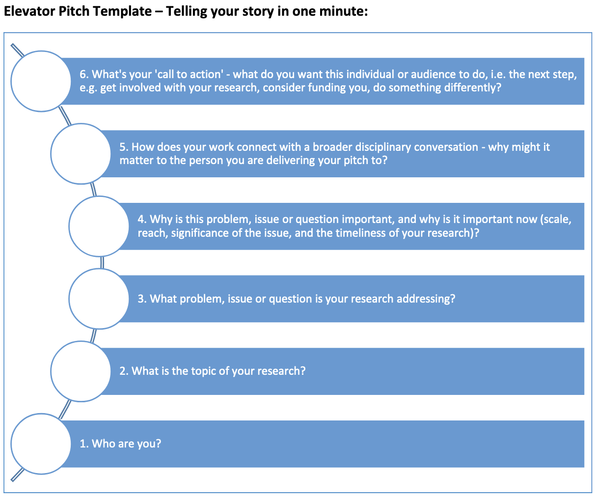

**CSC595** | **Term Portfolio Project** | Ashley Blacquiere

***

# Overview

This document is a record of my learning journey in *CSC 595 Research Methods* with Dr. Hausi Muller. If you're interested in learning more about Lean check out the [Lean Prover Community](https://leanprover-community.github.io/)!

# Table of contents

1. [Lecture notes, activities & post-class reflections](#lecturenotes)
2. [Research elevator pitch & discussion](#elevator-pitch)
3. [Notes & reflections on assigned homework](#homework-reflections)
4. [Research talk best practices & discussion](#research-talk)
5. [References](#references)
6. [Useful resources](#resources)

***

# Lecture notes, activities & post-class reflections

## Lecture 1 (Jan. 10, 2022)

__Class notes:__ I liked that Dr. Muller has asked everyone to speak in the class - I think this is an important hurdle to get over and helps to encourge more consistent contributions in future classes. I elected not to speak in the first class, primarily because I'm not really sure what my story is at this point. The parameters around my research project has only really started to become well-formulated in the last month or so, but the specifics of what my role is lack a clear motivation - other that that I need to complete some particular tasks in order to support those over-arching parameters. 

There were plenty of people who stated that their projects were not fully identified yet, and I don't really mind saying this, but I would rather give it a bit more serious thought - knowing that I can make an attempt in lecture 2. I did notice in listening to the other pitches that the most interesting were those that had some clear connection to broader issues or research disciplines, or bigger humanist concepts. This is something that I think I lack.

I was also struck (my 'aha!' moment for the day) by the advice to offer a _call to action_ at the end of an elevator pitch. This is a key idea for sure - not so much perhaps for a research talk, but definitely for an elevator pitch. I think this is something I'd like to try to incorportate into my pitch on Thursday.

__General reflection:__ I can't say that I was entirely sure what to expect from CSC 595: I have heard varying reports about the course in previous years, but I was also aware that this was Dr. Muller's first time \[recently?\] teaching the course. I was, however, pleasantly surprised by the first lecture, particularly on the use of Jupyter Notebooks as a tool for _literate programming_ and the focus on each student's personal _learning journey_.

My own interest in literate programming began about four years ago as I was revamping some dated curriculum that was part of the program I teach at [North Island College](https://www.nic.bc.ca/programs/business-applied-studies/digital-design-development/). I had come across the term while studying scholarship of teaching and learning papers from [ACM SIGCSE](https://www.sigcse.org/) and it struck me as an excellent pedagogical tool that could be brought to bear in my classrooms: my students typically have broad ranging backgrounds and levels of proficiency and many are coming to programming for the first time, or after a lengthy career in another field and so literate programming seemed to me to be an excellent tool for the communication of programming concepts embedded in the very object they're using in practice.

Unfortunately, our programs at that time focused primarily on web technologies in the first year of instruction, and I stuggled to find an appropriate fit with JavaScript that didn't require that the students be forced to adopt a new interface. I was able to implement something in this vein using [Swift Playgrounds](https://www.apple.com/swift/playgrounds/) for my second year students studying Swift, but the first year students were left without. I haven't lost interest, however, and would like to incorporate something like this into my newer Kotlin and Android Studio based courses. 

Fast forward to fall 2020 as I was beginning my MSc studies at UVic: The funding I have received for tuition costs has been provided as part of my professional development fund at North Island College, and part of my committment to justifying this funding has been to record my learning journey in the form of a Jupyter Notebook. So I'm happy to be continuing this activity in a more official capacity in CSC595, where I'm finding myself at the intersection between literate programming and my own learning journey.

## Lecture 2 (Jan. 13, 2022)

__Class notes:__ I offered my pitch today. I had given it some thought over the intervening days and had arrived at a fairly short pitch that sounded something like the following:

> My name is Ashley Blacquiere, and I am an MSc student in the computational theory group under the supervision of Dr. Bruce Kapron. My research interests are in the are of mathematical proof assistants and particularly the proof assistant Lean. For my research project I'll be working on the development of new proof tactics in Lean for the purpose of demonstrating the correctness of certain cryptographic primitives.

Then, because my 'aha!' moment after lecture 1 was the call to action idea, I dropped a link to the [LeanProver](https://leanprover.github.io/) site in the chat. 

Alas, maybe someone clicked on the link, but no one mentioned if they did. I felt like my pitch fell somewhat flat and it occurred to me afterwards that I didn't do those things that I realized after lecture 1 were fairly critical: including having a clear connection to a meaningful research domain or humanist concern. I threw out a mention of cryptographic, but I was intentionally cryptic (haha, pun intended) because I don't really know a lot about cryptography and I didn't want to imply that my work would be cryptographic in nature (Bruce and our research partners are handling the crypto stuff - I'm the Lean expert). Now, however, I feel I'm at a loss as to how to communicate that critical touchpoint to others. This requires more thought...

My 'aha!' moment in class today was the idea of pointing to two seminal papers in my field as part of my elevator pitch. Clearly this applies only to elevator pitches given to researchers, and not to laypeople.

__General reflection:__ There is clearly a balance to be struck in terms of the length of an elevator pitch and its content. There were a couple pitches in class today that were really quite good, but that were surprisingly long. That said, one can fit quite a lot of content into a minute if determined to do so (I think my pitch was probably 20 seconds or less). I wonder if having a number of exit points in a longer pitch could be a good strategy for developing multiple pitches that could be deployed at any one time?

## Lecture 3 (Jan. 17, 2022)

__Class notes:__ Dr. Muller's point regarding the importance of slides when there is no textbook is well taken. In many of my classes I don't rely on textbooks, but I do collect large amounts of material that students can engage with. These days I usually even make clear that all that extra material is optional, since not all students engage with it anyway. That said, I've always had a dislike for slides, and I often find myself trying to identify alternative ways of communication the same information but in a more interactive means. Boardwork is one method, but I'm rarely disciplined enough to make good notes, and so I usually end up going a little tangential. Most times, I rely on live coding and code walkthroughs, since that is primarily what my students want to see anyway.

I've always been enamoured with the idea of a good example providing critical motivation to understanding a concept. And I very much envious of those instructors who have some combination of the aptitude, the time, and / or the right class and content to make meaningful pithy examples for many lectures. It puts me in mind of that quote of Mark Twain's (which I'm paraphrasing): "I didn't have time to write you a short letter, so I've written you a long one...", which serves to point out the amount of work it can be to produce something meaningful and concise.

Winston's big four are:
* cycle
* verbal punctuation
* near miss
* ask a question
    
I think I do the first, second and third pretty well already (though I'm sure I could use some work on any one of them). The 'near miss' is kind of brilliant (this is my 'aha!' moment for the day). I think it could be the right kind of way of thinking to address the idea of the 'motivating example' (discussed below).

__General reflection:__ Winston's idea of being cyclic in a presentation reminds me of the advice I once had from a theatre instructor some years ago: He spoke of the concepts of *reuse* and *reincorporation* as they relate to performance and presentation. Perhaps it was more the former though, because as I think of it I believe this idea came initially from improv and theatre games, where a performer is expected to accept what is offered and attempt to *reuse* and *reincorporate* it and other previously used material into their improvisation. The logic being that something familiar to the audience is funnier because they can *predict* the outcome when it's well-telegraphed and so the audience feels like they're part of the joke - an in-joke between the performers and the audience. Although Winston made a good point regarding jokes and one's ability to pull off a joke naturally, I think the idea itself has merit; I've often found myself calling back on examples from early in a class to help elucidate a point - cyclic, like Winston, but sometimes improvisational, like *reuse* and *reincorporate*. 

## Lecture 4 (Jan. 20, 2022)

__Class notes__: We continued with Patrick Winston's 'How to Speak' videos today. There are certainly lots of great ideas present in these videos and I think a good strategy for anyone new to classroom instruction or speaking would be best served by trying to pick one or two ideas to try out, rather than attempt to adopt the entire suite of practices at once. For me, I think that idea of the near miss is one that I'd like to concentrate on in the short term.

I really liked the formula:
$$ 
\phi = f (K, p,\hspace{0.1cm} _t)
$$

__General reflections:__ I think that one of the most important of Winston's techniques discussed today is story. Winston's argument for the importance of the story, in terms of memory and retention are certainly in line with my own experience. That said, I rarely plan for the use of story in my lectures - though I do use anecdotes quite often, they're more often emergent events than planned ones. Hmm... Since most of my classes in the last two years have been asynchronous and recorded, I wonder if I am telling fewer stories... I suspect I probably am, but when I think of my teaching practice I still picture myself in a classroom, despite it having been nearly two years since that was the norm.

Perhaps there is something to be said for having a stock set of stories that could be deployed. Of course, it's not good to repeat stories and for them to get stale... But perhaps I should be thinking about lecture in the same way that I might think of a pitch or a research talk, both of which should be stories in their own right. I guess because lecture is *episodic* one can get away with breaking at inopportune points, knowing that you can pick it up later. But of course, the best lecturers are those who tell a story with every lecture... Hmm. This is my 'aha!' moment of the day, but I'm not sure what to do with it...

(As an aside, a few years ago I actually tried to write a class as an ongoing story, where each lecture / week was a chapter. The idea was that I would write a cohesive and compelling narrative to present throughout the semester. It feel flat though, since what seemed like a good idea in the spring when I was writing, sounded forced, or perhaps disingenuous, when prepped in the fall.)

I think the question of nervousness is an interesting one. I've been teaching full-time since 2014, on average probably eight courses per year, so somewhere around 60 or 70 courses over the last eight or so years. I'd say that on average the level of nervousness that I feel prior to a class has lessened significantly over the years, but I think to some degree it is still sometimes there - especially prior to a first class in the semester when I'm meeting new students for the first time. It's not the type of thing that typically lasts, though, and I would say that I have an overall different outlook on the subject of nervousness, compared to Winston's position on it.

In refernce to the formula above: I think the times that I have been *most* nervous have been those times when my *K* value has been too small. Especially in my early days of teaching, when I was working primarily as a sessional, I was willing to take any courses that were offered to me, even if they were pretty far outside my area of expertise. But I think my *p* value, in those cases, often made up for it. Of course, one might also argue that now that I am more established and teach fewer courses outside of my wheelhouse that a reduced nervousness is to be expected. Correlation, or causation?

That said, there must be an 'upper bound' on *K*, at least in the context of *p* and *t*. A large *K* cannot completely compensate for a completely negligible *t*. And I think there is a lot to be said about *types* of knowledge that might overlap with elements of *t*. In particular, I think that while Winston is absolutely right in what he presents in terms of *how to speak* in front of a class, and these types of lectures certainly have their place in the education system, there is increasing interest today in alternative pedagogical strategies that compliment lecture. Speaking certainly has it's place there, but do all of Winston's tools? 

## Lecture 5 (Jan. 24, 2022)

__Class notes:__
- These seem useful: 8 presentation tips https://www.synthego.com/blog/scientific-talk-tips

## Lecture 6 (Jan. 27, 2022)

__Class notes:__ The idea *not* to give it all away in the talk is a fantastic one - definitely the 'aha!' moment of the day. I mean, it feels a little hacky, or underhanded, but it makes an incredible amount of sense. From a lecture perspective it would be really useful as a tool to encourage discussion: leaving some low-hanging fruit out there means that students will be more willing to ask, and thus might be more engaged. 

We were asked in class to describe the advice we would give the pioneers of our respective fields if we were able to travel back in time with all the knowledge that we have today. Difficult, since I'm not sure my immediate field  is mature enough yet to warrant such consideration - I suppose there is always the "keep at it!" advice, since there are lots of naysayers when it comes to proof assistants. Anyway, I came up with the following:

>__Domain: Computational theory and proof assistants.__  
There is somewhat of a division today between developers and users of specific proof assistants (e.g. Lean, Coq, Isabelle/HOL, Agda). For the most part, this division isn’t antagonistic, but it is an undercurrent that runs throughout the discourse relating to which proof assistant is the ‘best’ tool for a particular application. This has the tendency to influence especially newer community members towards particular biases either for or against the use of specific proof assistants and can create some toxic interactions between different communities. I don’t think this is a problem specific to my domain, but perhaps it is all the more noticeable since in proof assistant development there is an incredible diversity of users with a broad spectrum of motivations and goals (i.e. from CS researchers interested in developing the language, to mathematician from many domains interested in using proof assistants for research purposes, to hobby users just interested in contributing in some way). My advice then is to consider how the various communities that form can be more inclusive and supportive of one another and their individual goals.  

__General reflections:__ I guess the idea of not giving it all away has some relationship to Winston's rhetorical questions, so we've sort of talked about it before. Honestly, though, it seems so obvious to do this I don't know why I haven't thought of it before. Maybe I have used it in the past in class, but it seemed so unremarkable to do so that I've just forgotten... Maybe this is again a symptom of all of my classes in the last two years being asynchronous: I don't really have to deal with student questions these days - expect by email or Slack.

## Lecture 7 (Jan. 31, 2022)

__Class notes:__
- I've kept my LinkedIn relatively up-to-date for the last ten years or so, but I dislike spending time on the site. It always feels like there is a lot of posturing... I checked it not too long ago and was looking relatively representative, but I probably should give it another update soon.
- I have a couple GitHub accounts: One that I use as a teacher and one that I use for personal use (also currently using it as a student at UVic). The nice thing is that since both are currently associated with educational activities (teacher and student respectively) I've got Pro status on both. I've used GitHub pages before, but haven't thought about using pages for a research purpose...
- [ORCID](https://orcid.org/) is interesting. I hadn't heard of it, but it seems like something I should register for.
- [DBLP](https://dblp.org/) is also new to me.
- [ResearchGate](https://www.researchgate.net/) I know about, but haven't used.
- It makes sense to use the above to follow top researcher in my field. Hadn't considered that before either, so I should get on that. Perhaps I should check [Research.com](https://research.com/) to source potential people to follow.

__General reflection:__ Although I've worked in industry previously, and have made efforts to follow industry leaders when it comes to social media and blogs, for some reason I haven't really thought to do so when it comes to research. I've been paying attention to community forums in my field, but not to specific individuals. This is something I should change - definitely my 'aha!' moment for the day.

It's funny that I haven't thought to do this, since I do follow some *publications* that in some ways serve the same purpose, though that are typically more general audience focused. [Quanta Magazine](https://www.quantamagazine.org/) is by far one of my most favourite things, and I think everyone in CS and Math (and other sciences too, of course) should pay attention to it; it's mandate of producing general audience content about recent and important scientific results is really quite admirable - especially since they do it so well! There should be more of this type of content available broadly.

(Or maybe I haven't thought of following researchers directly since any time I've tried before I've had a hard time getting over the inital difficulty of reading content within a field that I don't have a lot of experience in. Now that I've been working on this MSc (part-time) for more than a year, I feel like I have a better basis from which to attack this idea.)

Conferences are another good thing to think about: Bruce and I have discussed off and on, but haven't identified quite the right one at this point. I'd like to go to a formal verification, or a Lean-specific conference / workshop. I expect there might be one at some point this year... Funny story: The last face-to-face conference that I was at was the SIGCSE conference in Portland in March 2019. Can you imagine how that ended? :)  I arrived just as things were getting really bad in Oregon, attended one workshop the night of my arrival, and by the next morning the organizers had completely canceled the conference. I scrambled back to the airport and managed to catch and early flight home that day (though it had some long lay-overs). I was gone less than 36 hours, but because I crossed the boarder, for my trouble I got to stay home in self-isolation for two weeks...

## Lecture 8 (Feb. 3, 2022)

__Class notes:__ I wrote down the following points during class today. I think my 'aha!' moment was the idea that I should be able to identify the top three researchers (for me) in my field. Not necessarily the top three of all lists, but the top three that are most important to *my* particular project.
- In CS conferences typically have higher impact than journals.
- Who are the top three people (for you) in the world for your particular field?
    - Who is referencing whom?
    - Find keywords that are relevant to your interests.
- Reference aids: Use Mendelay or BibTek - why not Zotero?
- I asked about journal and conference supports for reviewers and Dr. Muller stated that choosing the right editor-in-chief or conference chair is incredibly important so that they can provide constructive feedback to reviewers.
  
__General reflection:__  In terms of those alleged negative reviews who review only to tear down others' work: what I wonder is why that culture of "trashing papers" even exists. I guess there will always be people who want to take others down, but I wonder if there is something inherent to the culture that results in this type of behaviour? If editors and chairs are empowered to provide constructive criticis, then that should curtail some of this, but I guess there are instances where things slip under the radar for a variety of reasons. 

This is difficult to articulate because I'm not *inside* at the moment - I'm looking from the outside based on what I've heard from others who have been part of peer review. Maybe the problem isn't as bad as I assume it is, or that it appears to be from reports, but it certainly does seem prevalent in many disciplines. Taking a step back then, the question i: if checks and balances do exist (i.e. empowered editors), why is it that there always seems to be this undercurrent of the failures of peer review? Are we making a bigger deal of it than it is - because it's *not* perfect? Are we expecting too much? Do we - as a culture - for some reason feel the need to apologize for the peer review process? Is this due to the well-publicized failures of the review process in recent years where bogus papers have been accepted, and bad science has had major societal influences (e.g. the anti-vaxx movement). Are the complaints we have about peer review actually sound, or do scientists complain because it seems like the right thing to do? are we a culture of apologists? O.o

If the complaints are valid (and I lean toward assuming they are), then I wonder - as stated above - if there is something about the process or about the academic culture that fosters this subversive behaviour (i.e. reviewers trashing papers) in terms of review. Or is it just the power of \[supposed\] anonymity that encourages this behaviour? If it is cultural, then *should* we be looking for an alternative to peer review? I don't have any good suggestions, but I am certainly wary of historical institutions that resist change because of *a priori* logic.

***

[Back to top](#overview)

# Research elevator pitch & discussion

## The elements of a research pitch
- Start writing the pitch by thinking about why the research must be done [1].
- A clear introduction (say name slowly!) is critical when presenting to new people.
- Keep tone conversational and natural, but enthusiastic! Memorizing a pitch word for word means potentially losing the natural rhythm of speech and delivery may be stilted.
- Keep language natural, and reduce jargon.
- Make the abstract concrete by using "real-world comparisons" [1].
- Use the unexpected to gain the audience's attention [1].
- Earn the attention of the audience through use of a hook - this is the *key* differentiator across different pitches, since each pitch must be geared towards a different audience.
    - For an interview / job application pitch: use the STAR (situation, task, action, result) method [2].
    - For a research pitch: consider identifying two key papers in the domain and answer these questions in the pitch [3]:
        - What is your research topic?
        - What problem / issue / question are you addressing via research?
        - Why is your problem interesting and important?
        - How does your work connect with a broader disciplinary conversation about this topic/problem in your field, and what does it add to that conversation?.
- Finish with a call to action - give the audience an opening for a question, or an action to take to learn more. 
- Consider the following template [4]:

## The elements of a good research pitch performance
Assuming a non-specialist audience [5]:
- Use shorter words, sentences and paragraphs.
- Choose active verbs over passive verbs.
- Be inclusive in language choices (avoid academic choices like "discourse").
- Qualify names on introduction.
- Have a beginning, a middle and an end; or use a circular structure. Either way - tell a story!
- Include a "hook" - something emotive, humanist. Make the audience care [1].

## Some notes from 3MT winning pitches
[Azalia Muchransyah, 2021 winner](https://www.youtube.com/watch?v=-SvgzP_Fz9U)
- Excellent use of using the unexpected and telling a humanist story. 
- First minute or so is the hook, second minute is the motivation (societal and cultural issues in Indonesia), third minute is the solution provided by her research.
- Great pace and expression.

[Sean Marrs, 2020 winner](https://www.youtube.com/watch?v=oyH3FLo7-0Y)
- Opens with the story of a historical figure who to contextualize his research into the 18th century surveillance state in Paris.
- Weaves the story of this historical figure in and out of the story of his research. This is a very successful cyclical approach.

[Ben Rein, 2020 winner](https://www.youtube.com/watch?v=nBVLySBtAW8)
- Broke down the concepts brain activity by relating it to traffic patterns and red and green lights.
- This analogy persisted throughout the pitch and helped concretize the core idea. 

## Aha! moments that I'd like to incorporate 
Some of these are replicated in the notes above, but these are moments that stood out either during lecture, or watching assigned videos:
- Include a call to action at the end of the pitch.
- Point to two seminal papers that help to contextualize the pitch.
- Including a near miss is something more for lecture than for pitch, but I think it somewhat speaks to the idea of using real-world comparisons, as stated above; statistics and absolute quantity don't communicate well, but relations do. 
- Tell a story!
- Don't give it all away - leave some opportunity for easy questions.

## Developing my research pitch

### Why the research must be done
This is a difficult one for me to fully qualify. My research projet is a small part of a larger effort within cryptography, but I have very little familiarity with cryptography. That said, my novice understanding could be something of a benefit here - I can provide some context, but don't have the vocabularly to even approach being overwhelming. 

From what I understand (and with reference to [6]), the overarching goal of the research is to identify structural properties of cryptographic primitives as they relate to typical cryptographic assumptions. The typical approach of building complex primitives from assumptions is in some senses limited; the research in [6] demonstrates that another way of demonstrating the "feasibility" of primitive consruction is possible. This in turn opens up new questions relating to simpler constructions of important primitives, or relating to the development of new assumptions or primitives. 

My part in this is in the development of proof assistant (i.e. [Lean](https://leanprover-community.github.io/)) tactics to prove the security of the constructions posed in [6]. As a relatively new, but highly popular proof assistant, Lean represents a new frontier in the development of formal verifcation tools. Additionaly, it has perhaps   less baggage than [Coq](https://coq.inria.fr/), which historically has been the proof assistant of choice in any cryptographic applications. In that sense the work I do will be relatively novel, and we hope that the work will continue to have broad application in providing demonstrable security for newly developed cryptographics primitives. 

### Pitch structure

#### The beginning
- Introduction: "Hi my name is Ashley and I'm a masters student in the department of computer science..."
- Start by introducing Alice and Bob and their communication woes
- Complexity of proof of security for cryptographic primitives? Are we ever really sure...?
- Cryptographic primitives *are* fallible... cryptographic protocols can fail - sometimes surprisingly

#### The middle
- Formal verification (find a better way to say this) provides tools for increasing our certainty.
- Lean is a programming language, but one different from stalwarts such as Java, C and Python. 
- Embedded inside Lean is a trusted kernel that is a sound basis for writing mathematical proofs. This means that Lean can be used to verify mathematical claims in a structured and reliable way.
- Built on top of Lean is a growing library of mathematical knowledge and tools, known as *mathlib*, that continues to support the development of mathematical results of increasing complexity.
- My goal is to contribute to *mathlib* by producing foundational tools that can be used to demonstrate the security of cryptographic primitives. 

#### The end
- To find out more about Lean and *mathlib* check out the [Lean Prover community site](https://leanprover-community.github.io/index.html)
- To learn more about the cryptographic goals I'm contributing to see [Minicrypt primitives with algebraic structure and applications](https://eprint.iacr.org/2019/108.pdf).

### Complete script
Hi, my name is Ashley and I am a master's student in the department of computer science. You might have heard of Alice and Bob; they've been trading secret messages back and forth as part of cryptographic research since 1978. Over those years Alice and Bob managed to continually improve their methods and keep their communication secure, despite major advances in computational power.

But the cryptographic tools Alice and Bob use *are* fallible - sometimes surprisingly so. Recent cryptograhpic research has demonstrated that it is possible to build new cryptographic tools from unexpected sources; but the proof that these techniques are secure - in a cryptographic sense - is a challenge best handled by formal verification.

In my research project I use the Lean programming language to demonstrate the security of these cryptographic techniques. Embeded in Lean is a trusted kernel that can be relied upon in the development of rigorous mathematical proof. These proofs are rigorous because Lean's trusted kernel is sound, implying the validity of all logic and proof that stem from the kernel. My research also helps to push the boundaries of interactive proof systems and to advance the broader project of proof automation in mathematics.

To find out more about my work, please visit my GitHub page at ashandoak.github.io

## The development of my pitch and reflections
Although Bruce and I have had a pretty good idea of which direction I'd be going in for my MSc project since mid-last semester, it's really only been since some time in December that we've started to formalize it, and since I've met our project collaborators. So in that sense, I'm just getting up to speed with a lot of the ideas I've discussed above. The development of my pitch and the work I've had to do to wrap my head around the motivations of my research are not something I'd yet been able to make the time for - so this has been incredibly valuable! I now feel that I have a better handle on what I'm doing and why I'm doing it.

The loose pitch script above came about relatively easily, although some additional practice was needed to build something that sounded natural. the structural approach was particularly helpful, as I was able to easily identify where I could inject some story and where I could be more technical. Also, some of the questions for research pitches listed above (in the *elements of a good pitch* section) were helping in identifying how I am contributing to the broader field. Although I don't think I've fully capitalized on that yet - there is more to be said down the line, for sure. 

It took me a bunch of attempts to get it right - in the end I actually memorized the script. Funny story: I did about ten takes and finally got something I thought I was happy with, then realized that the mic had been off the whole time... Did another ten takes before I got it right with audio - so I have a good quantity of b-takes for a potential blooper reel. :)

## My research elevator pitch video
To see my research elevator pitch follow this [YouTube link](https://www.youtube.com/watch?v=cKoxkXV-uV0).

***
[Back to top](#overview)

# Notes & reflections on assigned homework

## [How to Give a Great Research Talk](https://www.youtube.com/watch?v=sT_-owjKIbA) - Simon Peyton Jones 

__In summary:__ Jones presents best practices for developing, preparing for, and delivering a *20 minute* talk. Jones argues that most talks that the audience will deliver throughout their career will be a 20 minute talk, as hour long talks are rare.

- Giving a talk is about communicating a single idea (an "intuitive feel for your idea")
- Remember that your audience has given you a precious gift: their time, since we only have a fixed amount of time each day
- You have two minutes to pose an *example* and demonstrate how to solve it to motivate and attract your audience. Examples are key to learning: We often learn from specific to general, but we are sometimes tempted to go from the general to the specific (see discussion about motivating examples above)
- "Ruthelessly prune" material from the talk to ensure you can deliver the *key idea*. Your talk should only provide the *motivation* and the *key idea*. Don't focus on the technical details, but rather the *insight* that that detail provided.
- Avoid shallow overviews - it's ok to cover only *part* of the paper.
- Outlines are ok if used for signposting during the talk, but don't spend time on it (or *briefly* after the motivation).
- Repetition: Don't repat, because 20 minutes is too short, but perhaps repeat through additional examples when necessary. 
- Deal with antagonistic questions or technical questions with a constructive approach: "Great, but I just want to get to these key ideas..." 

## [Creating effective slides: Design, Construction, and Use in Science](https://www.youtube.com/watch?v=meBXuTIPJQk) - Jean-luc Dumount

__In summary:__ Dumount presents compelling arguments for the use of slides from an accessibility and *effective redundancy* perspective, but stresses that a talk is *not* exclusively the talk. Dumount encourages proper talk presentation, including planning (i.e. audience, needs, motivation, room conditions, etc.) and the *so what?* (i.e. the motivation, key idea and insight that the talk provides). Dumount argues that one should do slides *well* or not at all, else they are counter productive.

- Interestingly, the open 14 minutes of the talk accomplishes precisely Jones' arguments: Provide specific examples to motivate the audience's interest and provide a solution to that introduces the key ideas of the talk. Perhaps 14 minutes is a bit long, but the examples were engaging and the talk is a full hour, not 20 minutes.
- Slide are about accessibility and *effective redundancy*: for the differently abled, for non-native speakers, for conference attendees who are tired and hungry. The slides can provide a common experience. Slides should never:
    - Be written for the speaker (i.e. speaking notes)
    - Replace a report (i.e. slides rather than a written report - more common in business)
    - Be written in a hurry (shows disrespect for the audience)
- Strongest reccommendation in slide construction: State the *so what* not the *what* and write it as a full sentence in the title area with a good line break.
    - Start from a message. Ask: What am I trying to tell people?
- Speaking transitions between slides is a critical way to maintain cohesion through the talk. You must be able to deliver your talk *without* the slides. 

## [Designing effective scientific presentations](https://www.youtube.com/watch?v=Hp7Id3Yb9XQ) - Susan McConnell

__In summary:__ In this highly practical talk McConnel presents a number of best practices in slide construction and slide / talk structure and organization to create an effective talk. I think the key insight is the idea of the *key slide*, which is intended as a representation of the key idea of the talk, which can be used as a guiding tool throughout the talk. 

- We are all *listening* experts. Then why do we have so much trouble translating what we *want* as listeners into slides?
- Best practices:
    - Use sans serif (Ariel or Trebuchet)
    - 18 points or higher (up to 36). References can be 14 points
    - Avoid all caps in all cases (including titles)
    - Light background and dark letters (high contrast) and remove all extraneous material (logos, footers - other than for maybe page numbers, and graphics)
    - Headings should be statements 
    - Limit text blocks to two lines or less (except perhaps for quotations)
    - Lists should be three items
    - Be generous with empty space in slides
    - Use an image on *every* slide - then the audience can take in content from the title (a statement), the image, and aurally - each of which should support the other.
    - If you're not going to take the time to explain a slide (in whole or part) get rid of it. Prune all extraneous information
    - Avoid transitions except in scenarios where they can help telegraph the action (e.g., zooming in on a portion of a slide)
    - Don't drown the audience in data - less is more. Ask what can be cut - not what can be added.
- Structure the main part of the talk as a series of episodes. Each section of the main part of the talk should start nontechnical, move into general technical and finally to specifics. Once the specifics are done go back to the *home slide* that brings the focus back and telegraphs key questions the audience might be asking, or should be asking.
- Consider the conclusion as an opportunity to reiterate the key insights of the talk, but also the big picture. 

***

[Back to top](#overview)

# Research talk best practices & discussion

## Reflections on talks by Winston, Simon, Dumount and McConnell on research talks

Unquestionably, the common thread through all of these resources are the concepts of intuition, story, and humanist appeal. When it comes especially to shorter modes, such as the elevator pitch and the 20-minute research talk, the important of providing some meaningful intuition that can communicate your key ideas to the audience is critical. Good stories (or analogies, as with the traffic stop / brain activity 3MT talk above) can help cement these intutions into longer-term memory, while appealing to humanist ideals helps to ground intuition in meaning real-world concerns.

From a practical talk / slide construction perspective I'm also pretty enamoured of *effective redundnacy* and *relentless pruning*. I think the idea of effective redundancy speaks a bit to the question I tried to ask about "slides as props" during the second Winston class. I don't think I clearly articulated what I was feeling, but there were something about the distinction between *slides as communication tools* and *slides as performance* that was sort of tickling my brain... I'm still not sure there is really anything there, but the idea that slides exist as a tool of [universal design for learning](https://udlguidelines.cast.org/) feels right, whereas the idea of slides as a tool for motivation (as a more traditional *slideshow* might be) seems appealing, but less is clearly less accessible. I think, fundamentally, I dislike slides as they are typically conceived and I struggle to find value in them (from a teaching perspective) when I know that students often expect them.

I *wish* I had time for relentless pruning... But, as the Mark Twain quote above states, it's not always easy to write a short letter. I guess when it comes to a really high stakes talk, I would almost certainly spend the time, but in terms of lectures I'm often constructing slides days, or at best a week before their use, and I just don't have the time, along with my other responsibilies.

Interestingly, I thought that the talk by Susan McConnell, about slide best practices, would be the least valuable of the three. However, the day after I watched it I needed to make some slides for a class I'm teaching and her advice was on my mind. I decided to lay out the slides by first writing out a bulleted list with sub-bullets that covered the content I wanted to get to. Each bullet was a full sentence and would eventually become the slide heading/title, and each sub-bullet became a bulleted point on the slide (though some slides were just pictures).

In the course of this it came about very naturally that I ended up using a *home slide* to bring the focus back to the main motivation of the lecture. I didn't *intend* to use one, but it became clear about half way through that it would be highly valuable as a tool to *cycle* back and reaffirm the goals of the lecture. In addition, the full sentence heading/title was remarkably effective at getting the point across. Like many, I think I've typically thought of the title as literally that, but why not use the largest emphasis on the screen to get the main point across? It made pruning the actual bullets much easier as I didn't have to try to communicate both contextual information and the point all at one time. 

I've only done this for one set of lectures, but at this point, I think I'm a convert...

***
[Back to top](#overview)

# References

[1] Inger Mewburn. 2010. How to Sell Your Theseis in 3 Minutes (or Less). The Thesis Whisperer. Retrieved January 27, 2022 from https://thesiswhisperer.com/2010/07/01/how-to-sell-your-thesis-in-3-minutes-or-less/.

[2] Elevator Pitch Practice. Manning College  of Information & Computer Sciences. Retrieved January 18, 2022 from https://www.cics.umass.edu/careers/articles/elevator-pitch-practice/.

[3] Gretchen Busl and Matthew Capdevielle. The Elevator Pitch: Presenting Your Rsearch in Conversation. University of Notre Dame. Retrieved January 18 2022 from https://graduateschool.nd.edu/assets/76988/elevator_pitch_8_28_2012.pdf/.

[4] MMU. One Minute Elevator Pitch. Retrieved January 18, 2022 from https://www.mmu.ac.uk/media/mmuacuk/content/documents/research/Impact-Tool----Elevator-Pitch.pdf

[5] Simon Clews. 2013. Making the Most of Your Three Minutes. 3MT: The Three Minute Thesis. Retrieved January 27, 2022 from https://wp.auburn.edu/graduate_school/wp-content/uploads/files/3MT/Simon_Clews_3MT_guide.pdf

[6] Navid Alamati et al. 2019. Minicrypt Primitives with Algebraic Structure and Applications. In *Annual International Conference on the Theory and Applications of Cryptographic Techniques* 2019 May 19 (pp. 55-82). Springer, Cham. https://ia.cr/2019/108
***

[Back to top](#overview)

# Useful resources

- [Jupyter kernels](https://jupyter-client.readthedocs.io/en/stable/wrapperkernels.html)
- [Jupyter keyboard shortcuts](https://media.cheatography.com/storage/thumb/weidadeyue_jupyter-notebook.750.jpg?last=1462914889)
- [Jupyter notebook cheat sheet](https://cdn-images-1.medium.com/max/1600/1*_nFAOrPMxYwE7cBt-ryqZA.png)
- [Jupyter notebook cheat sheet](https://www.edureka.co/blog/wp-content/uploads/2018/10/Jupyter_Notebook_CheatSheet_Edureka.pdf)

***

[Back to top](#overview)
